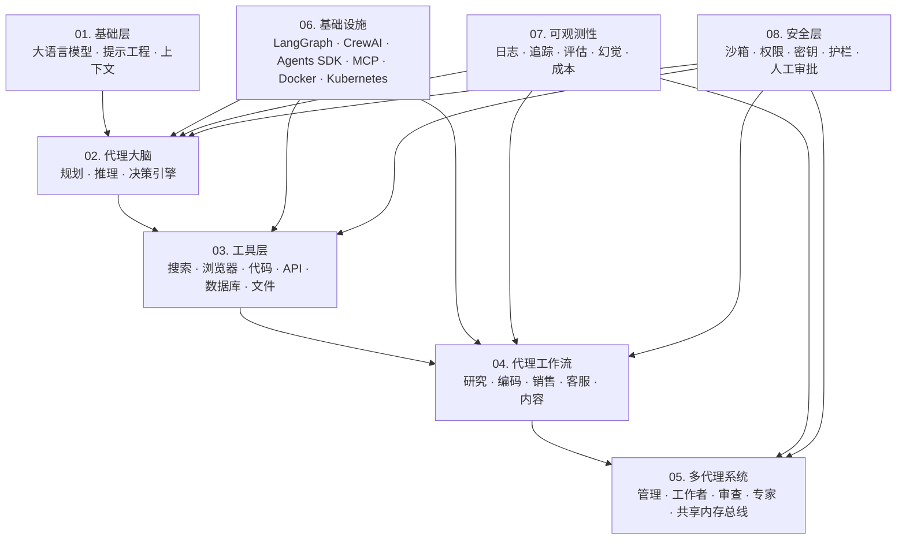

# Awesome AI Agent 全栈框架 

一张 AI Agent 工具体系的架构地图，覆盖基础模型、代理大脑、工具层、工作流、多代理系统、基础设施、可观测性和安全。

> **声明：** 本列表正在持续建设中，欢迎贡献！
> **策展规则：** 每个三级主题最多收录 10 个代表性 GitHub 仓库；如果暂时没有足够强、足够维护良好的项目，少于 10 个也可以。

**AI Agent 生态框架图**

## 目录

- [01. 基础层](#01-基础层)
  - [大语言模型](#大语言模型)
  - [提示工程](#提示工程)
  - [上下文](#上下文)
- [02. 代理大脑](#02-代理大脑)
  - [规划](#规划)
  - [推理](#推理)
  - [决策引擎](#决策引擎)
- [03. 工具层](#03-工具层)
  - [网络搜索](#网络搜索)
  - [浏览器自动化](#浏览器自动化)
  - [代码执行](#代码执行)
  - [API 集成](#api-集成)
  - [数据库访问](#数据库访问)
  - [文件系统](#文件系统)
- [04. 代理工作流](#04-代理工作流)
  - [研究代理](#研究代理)
  - [编码代理](#编码代理)
  - [销售代理](#销售代理)
  - [客户支持代理](#客户支持代理)
  - [内容代理](#内容代理)
  - [自主工作流](#自主工作流)
- [05. 多代理系统](#05-多代理系统)
  - [管理代理](#管理代理)
  - [工作者代理](#工作者代理)
  - [审查代理](#审查代理)
  - [专业技能](#专业技能)
  - [共享内存总线](#共享内存总线)
- [06. 基础设施](#06-基础设施)
  - [LangGraph](#langgraph)
  - [CrewAI](#crewai)
  - [OpenAI Agents SDK](#openai-agents-sdk)
  - [MCP](#mcp)
  - [Docker](#docker)
  - [Kubernetes](#kubernetes)
- [07. 可观测性](#07-可观测性)
  - [日志](#日志)
  - [追踪](#追踪)
  - [评估](#评估)
  - [幻觉检查](#幻觉检查)
  - [成本监控](#成本监控)
- [08. 安全层](#08-安全层)
  - [沙箱化](#沙箱化)
  - [权限控制](#权限控制)
  - [密钥管理](#密钥管理)
  - [护栏](#护栏)
  - [人工审批循环](#人工审批循环)
- [贡献指南](#贡献指南)
- [许可证](#许可证)

---

## 01. 基础层

### 大语言模型

> **[最近复核：2026-05-24]** 各家模型阵容变化很快。下面每个 provider 选 5 个当前或仍具代表性的模型/产品端点；实际使用前请以官方模型页的别名、价格和可用区域为准。

#### 商业 / 云端提供商

- **OpenAI**
  - [GPT-5.5](https://platform.openai.com/docs/models) - 面向复杂推理、编码和专业工作的旗舰模型。
  - [GPT-5.4](https://platform.openai.com/docs/models) - 更经济的前沿模型，适合编码和专业工作。
  - [GPT-5.4 mini](https://platform.openai.com/docs/models) - 面向编码、计算机使用和子智能体的高能力 mini 模型。
  - [GPT-5.4 nano](https://platform.openai.com/docs/models) - GPT-5.4 级别中最低延迟、最低成本的模型。
  - [GPT Image 2](https://platform.openai.com/docs/models) - 先进图像生成和编辑模型。

- **Anthropic**
  - [Claude Opus 4.7](https://docs.anthropic.com/en/docs/about-claude/models/overview) - 当前 Claude 中能力最强的通用模型，适合复杂推理和智能体编码。
  - [Claude Opus 4.6](https://docs.anthropic.com/en/docs/about-claude/models/overview) - 上一代 Opus 4，高阶多步骤任务仍有代表性。
  - [Claude Sonnet 4.6](https://docs.anthropic.com/en/docs/about-claude/models/overview) - 当前 Claude 阵容中速度和智能的最佳平衡。
  - [Claude Sonnet 4.5](https://docs.anthropic.com/en/docs/about-claude/models/overview) - 支持扩展思考且云端可用性广的强 Sonnet 版本。
  - [Claude Haiku 4.5](https://docs.anthropic.com/en/docs/about-claude/models/overview) - 当前最快的 Claude 模型，具备接近前沿的智能。

- **Google DeepMind**
  - [Gemini 3.1 Pro](https://ai.google.dev/gemini-api/docs/models/gemini) - 面向复杂问题求解、智能体和编码任务的高级智能模型。
  - [Gemini 3.5 Flash](https://ai.google.dev/gemini-api/docs/models/gemini) - 面向持续智能体和编码负载的稳定前沿性能模型。
  - [Gemini 3 Flash](https://ai.google.dev/gemini-api/docs/models/gemini) - 以更低成本提供前沿级性能的 Flash 模型。
  - [Gemini 3.1 Flash-Lite](https://ai.google.dev/gemini-api/docs/models/gemini) - 面向低延迟、低成本场景的高效 Flash-Lite 模型。
  - [Gemini 3.1 Flash Live](https://ai.google.dev/gemini-api/docs/models/gemini) - 面向实时对话和语音优先应用的低延迟 Live API 模型。

- **Mistral AI**
  - [Mistral Medium 3.5](https://docs.mistral.ai/getting-started/models/) - 面向智能体和编码场景的前沿多模态模型。
  - [Mistral Large 3](https://docs.mistral.ai/getting-started/models/) - 先进开放权重通用多模态模型。
  - [Mistral Small 4](https://docs.mistral.ai/getting-started/models/) - 高效的指令、推理和编码混合模型。
  - [Magistral Medium 1.2](https://docs.mistral.ai/getting-started/models/) - 前沿多模态推理模型。
  - [Devstral 2](https://docs.mistral.ai/getting-started/models/) - 面向软件工程任务的代码智能体模型。

- **Cohere**
  - [Command A+](https://docs.cohere.com/v2/docs/models/) - 面向高能力企业生成任务的最新 MoE 模型。
  - [Command A Reasoning](https://docs.cohere.com/v2/docs/models/) - 面向复杂问题求解和智能体任务的推理模型。
  - [Command A](https://docs.cohere.com/docs/model-vault) - 覆盖企业场景的强通用模型。
  - [Embed v4.0](https://docs.cohere.com/v2/docs/models/) - 面向搜索和检索的多模态嵌入模型。
  - [Rerank v4.0 Pro](https://docs.cohere.com/v2/docs/models/) - 面向检索管线的高质量重排模型。

- **Amazon（Bedrock & Titan）**
  - [Nova Premier](https://aws.amazon.com/bedrock/nova/) - Amazon Nova 中能力最强的模型，也可作为蒸馏教师模型。
  - [Nova Pro](https://aws.amazon.com/bedrock/nova/) - 高能力多模态模型。
  - [Nova Lite](https://aws.amazon.com/bedrock/nova/) - 高吞吐量场景的高性价比模型。
  - [Nova Micro](https://aws.amazon.com/bedrock/nova/) - 最低延迟的纯文本模型。
  - [Titan Text Premier](https://aws.amazon.com/bedrock/) - 企业级文本生成模型。

- **xAI**
  - [Grok 4.3](https://docs.x.ai/developers/models) - 当前旗舰文本模型，适合智能体工具调用。
  - [Grok Build 0.1](https://docs.x.ai/developers/models) - 面向构建工作流的代码端点。
  - [Grok Voice API](https://docs.x.ai/developers/models) - 实时语音识别、语音合成和语音智能体能力。
  - [Grok Imagine Image API](https://docs.x.ai/developers/models) - 图像生成和编辑端点。
  - [Grok Imagine Video API](https://docs.x.ai/developers/models) - 视频生成和编辑端点。

- **AI21 Labs**
  - [Jamba Large 1.7](https://docs.ai21.com/docs/jamba-foundation-models) - 面向企业复杂任务的最强 Jamba 模型。
  - [Jamba Mini 2](https://docs.ai21.com/docs/jamba-foundation-models) - 12B 激活参数的高效企业工作流模型。
  - [Jamba2 Mini](https://docs.ai21.com/docs/jamba-foundation-models) - 高效、可控的核心企业任务模型线。
  - [Jamba2 3B](https://docs.ai21.com/docs/jamba-foundation-models) - 面向端侧和智能体系统的紧凑模型。
  - [AI21 Maestro](https://docs.ai21.com/docs/jamba-foundation-models) - 围绕 AI21 基座模型构建的智能体编排层。

- **Reka**
  - [Reka Flash 3](https://reka.ai/news/introducing-reka-flash) - Flash 系列中的开放推理预览模型。
  - [Reka Core](https://reka.ai/) - Reka 系列中最大、能力最强的多模态模型。
  - [Reka Flash](https://docs.reka.ai/chat/models) - 快速多模态生产模型。
  - [Reka Edge](https://reka.ai/) - 面向边缘部署的轻量多模态模型。
  - [Reka Core 20240501](https://v0.docs.reka.ai/guides/005-listing-models.html) - 适合稳定部署的版本化 Core API 模型。

- **Writer**
  - [Palmyra X5](https://writer.com/llms/) - 面向企业智能体的高级长上下文模型。
  - [Palmyra X4](https://dev.writer.com/home/models) - 上一代企业通用模型。
  - [Palmyra X 004](https://dev.writer.com/home/models) - 面向工具调用和知识工作流的企业模型。
  - [Palmyra Med](https://dev.writer.com/home/models) - 医疗领域专用模型线。
  - [Palmyra Fin](https://dev.writer.com/home/models) - 金融领域专用模型线。

- **Perplexity**
  - [Sonar](https://docs.perplexity.ai/getting-started/models) - 轻量级、有引用依据的搜索模型。
  - [Sonar Pro](https://docs.perplexity.ai/getting-started/models) - 面向复杂问题的高级搜索增强模型。
  - [Sonar Reasoning Pro](https://docs.perplexity.ai/docs/sonar/models/sonar-reasoning-pro) - 结合检索的高级多步推理模型。
  - [Sonar Deep Research](https://docs.perplexity.ai/getting-started/models) - 面向长研究任务的深度研究模型。
  - [Sonar API](https://docs.perplexity.ai/getting-started/models) - 程序化搜索问答端点系列。

- **Inflection AI**
  - [Inflection 3.0 Enterprise](https://inflection.ai/enterprise) - 面向组织工作流调优的企业 AI 系统。
  - [Inflection 3.0](https://inflection.ai/enterprise) - Inflection 企业产品背后的基座模型。
  - [Pi](https://inflection.ai/) - 由 Inflection 模型驱动的消费级对话助手。
  - [Inflection-2.5](https://inflection.ai/) - 驱动 Pi 的上一代高能力模型。
  - [Inflection Enterprise Custom Models](https://inflection.ai/enterprise) - 面向业务流程的私有微调部署。

#### 开源 / 开放权重提供商

- **Meta**
  - [Llama 4 Maverick](https://llama.meta.com/) - 400B MoE 开源多模态模型（17B-128E）。
  - [Llama 4 Scout](https://llama.meta.com/) - 109B MoE 模型，1000万 token 上下文（17B-16E）。
  - [Llama 3.1 405B](https://llama.meta.com/) - 最大稠密开源模型。
  - [Llama 3.3 70B](https://llama.meta.com/) - 改进的 70B 参数模型。
  - [Llama 3.2 Vision](https://llama.meta.com/) - 开源多模态模型（11B/90B）。

- **DeepSeek**
  - [DeepSeek-V3.2](https://github.com/deepseek-ai/DeepSeek-V3) - 面向智能体的 MoE 模型，整合思考与工具使用。
  - [DeepSeek-V3.2-Speciale](https://github.com/deepseek-ai/DeepSeek-V3) - 面向数学和编码的 V3.2 推理强化版本。
  - [DeepSeek-R1](https://github.com/deepseek-ai/DeepSeek-R1) - 推动 2025 推理模型浪潮的开放权重推理模型。
  - [DeepSeek-Prover-V2](https://github.com/deepseek-ai/DeepSeek-Prover-V2) - 定理证明专业模型。
  - [Janus-Pro](https://github.com/deepseek-ai/DeepSeek-VL2) - 多模态理解与生成模型家族。

- **Qwen Team（阿里开源）**
  - [Qwen3.6-27B](https://github.com/QwenLM/Qwen3) - 具备强智能体编码能力的稠密开放权重模型。
  - [Qwen3-Coder-Next](https://github.com/QwenLM/Qwen3-Coder) - 面向软件工程工作流的代码智能体模型。
  - [Qwen3-VL](https://github.com/QwenLM/Qwen3-VL) - 面向长上下文多模态推理的视觉语言模型家族。
  - [Qwen3-VL-Embedding / Reranker](https://github.com/QwenLM/Qwen3-VL) - 多模态检索与排序模型。
  - [Qwen3-235B-A22B](https://github.com/QwenLM/Qwen3) - 面向混合思考的大型 MoE 开放权重模型。

- **Microsoft**
  - [Phi-4-reasoning-vision-15B](https://github.com/microsoft/Phi-4-reasoning-vision-15B) - 开放权重多模态推理模型。
  - [Phi-4-reasoning-plus](https://azure.microsoft.com/en-us/products/phi) - 面向数学和逻辑的更强 Phi-4 推理变体。
  - [Phi-4-reasoning](https://azure.microsoft.com/en-us/products/phi) - Phi-4 家族中的紧凑推理模型。
  - [Phi-4-mini-flash-reasoning](https://azure.microsoft.com/en-us/products/phi) - 低延迟混合推理模型。
  - [Phi-4-multimodal](https://azure.microsoft.com/en-us/products/phi) - 面向语音、视觉和文本的紧凑多模态 Phi 模型。

- **NVIDIA**
  - [Nemotron 3 Ultra](https://research.nvidia.com/labs/nemotron/Nemotron-3/) - 面向复杂智能体推理的最大 Nemotron 3 模型。
  - [Nemotron 3 Super](https://research.nvidia.com/labs/nemotron/Nemotron-3-Super/) - 面向多智能体系统的 120B 参数开放 MoE 模型。
  - [Nemotron 3 Nano](https://research.nvidia.com/labs/nemotron/Nemotron-3/) - 面向本地和边缘智能体负载的高效开放模型。
  - [Nemotron 3 Nano Omni](https://build.nvidia.com/) - 紧凑多模态 Nemotron 变体。
  - [Llama-3.1-Nemotron-Ultra 253B](https://build.nvidia.com/) - 早期 Nemotron 线中的微调推理模型。

- **Databricks**
  - [DBRX Instruct](https://www.databricks.com/) - 开源 132B MoE 指令遵循模型。
  - [DBRX Base](https://www.databricks.com/) - 开源基础 MoE 模型。
  - [MPT-30B](https://www.databricks.com/) - Databricks 收购 MosaicML 后延续的开放基座模型谱系。
  - [MPT-7B](https://www.databricks.com/) - 适合高效微调的早期 MosaicML 开放模型。
  - [Dolly v2](https://www.databricks.com/) - 推动开放商业可用指令数据普及的指令模型。

- **Snowflake**
  - [Arctic](https://docs.snowflake.com/) - 开源 480B MoE 企业任务模型。
  - [Arctic Embed Large](https://docs.snowflake.com/) - 高精度开放文本嵌入模型。
  - [Arctic Embed Medium](https://docs.snowflake.com/) - 面向检索系统的均衡嵌入模型。
  - [Arctic Embed Small](https://docs.snowflake.com/) - 面向成本敏感搜索的紧凑嵌入模型。
  - [Arctic Extract](https://docs.snowflake.com/) - 面向结构化业务数据的文档抽取模型。

- **Allen AI（AI2）**
  - [OLMo 3 Think 32B](https://allenai.org/) - 训练产物开放的完全开放思考模型。
  - [OLMo 2 32B](https://allenai.org/) - 开放数据、代码和检查点的完全开放基座模型。
  - [Tulu 3](https://allenai.org/) - 开放后训练和指令遵循模型家族。
  - [OLMoE](https://allenai.org/) - 开放混合专家语言模型。
  - [Molmo](https://allenai.org/) - 面向视觉语言任务的开放多模态模型家族。

- **Stability AI**
  - [Stable LM 2 12B](https://stability.ai/core-models) - 开放权重语言模型。
  - [Stable LM 2 1.6B](https://stability.ai/core-models) - 紧凑多语言模型。
  - [Stable Code 3B](https://stability.ai/core-models) - 紧凑代码基座模型。
  - [Stable Code Instruct 3B](https://stability.ai/core-models) - 指令微调代码模型。
  - [Stable Audio 3](https://stability.ai/research/stable-audio-3) - 面向生成式媒体工作流的当前开放音频模型家族。

- **Hugging Face（社区）**
  - [SmolLM3](https://huggingface.co/HuggingFaceTB) - 面向高效部署的紧凑开放语言模型家族。
  - [SmolVLM](https://huggingface.co/HuggingFaceTB) - 紧凑视觉语言模型家族。
  - [Zephyr](https://huggingface.co/HuggingFaceH4) - 开放聊天模型微调谱系。
  - [Idefics](https://huggingface.co/HuggingFaceM4) - Hugging Face 开放多模态模型家族。
  - [StarCoder2](https://huggingface.co/bigcode) - BigCode 社区开放代码模型家族。

- **Cohere For AI（研究）**
  - [Command A+](https://cohere.com/research) - 具备多模态推理和智能体能力的开放企业模型。
  - [Command A](https://cohere.com/research) - 面向生成和工具使用的企业级开放模型。
  - [Command R7B](https://cohere.com/research) - 面向检索增强生成优化的紧凑开放模型。
  - [Aya Expanse](https://cohere.com/research) - 多语言开放模型家族。
  - [Aya 23](https://cohere.com/research) - 覆盖 23 种语言的开放权重多语言模型家族。

#### 中国生态

- **阿里云（通义千问）**
  - [Qwen3-Max](https://tongyi.aliyun.com/) - 面向复杂推理和企业任务的旗舰商业 Qwen 模型。
  - [Qwen3-Plus](https://tongyi.aliyun.com/) - 面向生产负载的均衡商业模型。
  - [Qwen3-Turbo](https://tongyi.aliyun.com/) - 面向高吞吐应用的快速高性价比模型。
  - [Qwen3-Coder](https://github.com/QwenLM/Qwen3-Coder) - 面向智能体软件工程的代码专用 Qwen 模型。
  - [Qwen3-VL-Max](https://github.com/QwenLM/Qwen3-VL) - 商业多模态视觉语言模型。

- **百度（文心一言 / ERNIE）**
  - [ERNIE 5.0](https://yiyan.baidu.com/) - 面向多模态推理的最新旗舰文心模型。
  - [ERNIE X1](https://yiyan.baidu.com/) - 深度思考推理模型。
  - [ERNIE 4.5](https://yiyan.baidu.com/) - 面向企业场景的强多模态基座模型。
  - [ERNIE Speed](https://yiyan.baidu.com/) - 面向高吞吐任务的快速推理模型。
  - [ERNIE Lite](https://yiyan.baidu.com/) - 面向成本敏感生产场景的轻量模型。

- **智谱 AI（智谱清言）**
  - [GLM-4.6](https://bigmodel.cn/) - 当前旗舰通用模型。
  - [GLM-4.5V](https://bigmodel.cn/) - 面向多模态理解的视觉语言模型。
  - [GLM-Z1](https://bigmodel.cn/) - 面向推理的 GLM 模型家族。
  - [GLM-4-Flash](https://bigmodel.cn/) - 快速、低成本推理模型。
  - [CogVideoX](https://bigmodel.cn/) - 开源视频生成模型。

- **月之暗面（Kimi）**
  - [Kimi K2 Thinking](https://kimi.moonshot.cn/) - 面向复杂智能体工作的长程推理模型。
  - [Kimi K2](https://kimi.moonshot.cn/) - 具备强工具使用和长上下文能力的旗舰 MoE 模型。
  - [Kimi Linear](https://kimi.moonshot.cn/) - 月之暗面推出的高效长上下文模型架构。
  - [moonshot-v1-128k](https://platform.moonshot.cn/) - 面向文档密集任务的长上下文 API 模型。
  - [moonshot-v1-32k](https://platform.moonshot.cn/) - 均衡型长上下文 API 模型。

- **字节跳动（豆包 / Doubao / Seed）**
  - [Seed1.6](https://github.com/ByteDance-Seed) - 字节跳动最新 Seed 基座模型线。
  - [Seed1.5-VL](https://github.com/ByteDance-Seed/Seed1.5-VL) - 旗舰视觉语言 MoE 模型。
  - [Seed-Coder](https://github.com/ByteDance-Seed) - 代码专用模型家族。
  - [Doubao-Pro](https://team.doubao.com/) - 旗舰商业模型。
  - [Doubao-Lite](https://team.doubao.com/) - 轻量快速商业模型。

- **腾讯（混元 / Hunyuan）**
  - [Hunyuan TurboS](https://github.com/Tencent/Hunyuan-TurboS) - 旗舰快思考 MoE 模型，Hybrid-Mamba-Transformer 架构。
  - [Hunyuan T1](https://github.com/Tencent/llm.hunyuan.T1) - 强化学习驱动的推理模型。
  - [Hunyuan-Large](https://hunyuan.tencent.com/) - 开源 389B MoE 模型。
  - [Hunyuan-Pro](https://hunyuan.tencent.com/) - 商业 API 旗舰模型。
  - [Hunyuan-Video](https://hunyuan.tencent.com/) - 开源视频生成模型。

- **MiniMax（海螺AI）**
  - [MiniMax-M2](https://www.minimaxi.com/) - 面向编码和工具使用的开放权重智能体模型。
  - [MiniMax-Text-01](https://www.minimaxi.com/) - 开源 456B MoE 长上下文文本模型。
  - [MiniMax-VL-01](https://www.minimaxi.com/) - 视觉语言模型。
  - [Video-01](https://www.minimaxi.com/) - 视频生成模型。
  - [Speech-01](https://www.minimaxi.com/) - 文本转语音模型。

- **百川智能**
  - [Baichuan-M3](https://www.baichuan-ai.com/) - 百川推出的医疗专用模型。
  - [Baichuan 4](https://www.baichuan-ai.com/) - 具备推理和编码能力的旗舰通用模型。
  - [Baichuan 3](https://www.baichuan-ai.com/) - 上一代通用模型。
  - [Baichuan 2 13B](https://www.baichuan-ai.com/) - 开放权重双语模型。
  - [Baichuan 2 7B](https://www.baichuan-ai.com/) - 更小的开放权重双语模型。

- **零一万物**
  - [Yi-Lightning](https://www.01.ai/) - 超快速高性价比商业模型。
  - [Yi-Large](https://www.01.ai/) - 旗舰通用模型线。
  - [Yi-Vision](https://www.01.ai/) - 多模态视觉语言模型。
  - [Yi-34B](https://www.01.ai/) - 开放权重双语模型。
  - [Yi-9B](https://www.01.ai/) - 更小的开放权重双语模型。

- **科大讯飞（讯飞星火）**
  - [Spark X1](https://xinghuo.xfyun.cn/) - 讯飞星火家族中的深度推理模型。
  - [Spark 4.0 Ultra](https://xinghuo.xfyun.cn/) - 中文能力突出的旗舰通用模型。
  - [Spark Max](https://xinghuo.xfyun.cn/) - 高能力生产模型。
  - [Spark Pro](https://xinghuo.xfyun.cn/) - 均衡型企业模型。
  - [Spark Lite](https://xinghuo.xfyun.cn/) - 面向成本敏感负载的轻量模型。

- **商汤（日日新 / SenseNova）**
  - [SenseNova 6.0](https://sensenova.sensetime.com/) - 商汤最新多模态模型代际。
  - [SenseNova 5.5](https://sensenova.sensetime.com/) - 旗舰多模态模型。
  - [SenseChat](https://sensenova.sensetime.com/) - 面向企业助手的对话模型。
  - [SenseMirage](https://sensenova.sensetime.com/) - 图像生成模型家族。
  - [SenseTime Vimi](https://sensenova.sensetime.com/) - 视频和数字人生成模型家族。

#### 端侧 / 边缘

- **Apple** - [AFM（Apple Foundation Model）](https://machinelearning.apple.com/) - 端侧和服务端模型，驱动 Apple Intelligence。
- **Samsung** - [Samsung Gauss](https://research.samsung.com/) - Galaxy 生态的端侧和服务端 LLM。

#### 推理平台（托管开源模型）

- [Together AI](https://together.ai/) - 200+ 开源模型的无服务器推理。
- [Fireworks AI](https://fireworks.ai/) - 快速高性价比开源 LLM 服务。
- [Groq](https://groq.com/) - 基于 LPU 的超快推理。
- [Cerebras](https://cerebras.ai/) - 晶圆级推理加速。

### 提示工程

<b>系统提示</b> — LLM 系统提示合集与工具

- [system-prompts-and-models-of-ai-tools](https://github.com/x1xhlol/system-prompts-and-models-of-ai-tools)  `Framework` - 从 Augment Code、Claude Code、Cursor、Devin、Manus、Perplexity、Windsurf、v0 等提取的完整系统提示。
- [system_prompts_leaks](https://github.com/asgeirtj/system_prompts_leaks)  `Framework` - ChatGPT、Claude、Gemini、Grok、Copilot、Perplexity 等系统提示提取。
- [CL4R1T4S](https://github.com/elder-plinius/CL4R1T4S)  `Framework` - 泄露的系统提示合集——ChatGPT、Claude、Gemini、Grok、Cursor、Lovable、Replit。
- [leaked-system-prompts](https://github.com/jujumilk3/leaked-system-prompts)  `Framework` - 各类 LLM 产品泄露系统提示收集。
- [chatgpt_system_prompt](https://github.com/LouisShark/chatgpt_system_prompt)  `Framework` - GPT 系统提示收集，含提示注入和泄露技术。
- [claude-code-system-prompts](https://github.com/Piebald-AI/claude-code-system-prompts)  `Framework` `Infra` - Claude Code 完整系统提示：27 个内置工具、子代理提示、工具提示。
- [awesome-ai-system-prompts](https://github.com/dontriskit/awesome-ai-system-prompts)  `Framework` `Research` - 精选系统提示——ChatGPT、Claude、Perplexity、Manus、Claude Code、Lovable、v0、Grok。
- [TheBigPromptLibrary](https://github.com/0xeb/TheBigPromptLibrary)  `Framework` - 大型提示、系统提示和 LLM 指令合集。
- [tweakcc](https://github.com/Piebald-AI/tweakcc)  `Framework` `Infra` - 自定义 Claude Code 系统提示、工具集和主题。
- [awesome-system-prompts](https://github.com/langgptai/awesome-system-prompts)  `Framework` `Research` - DeepSeek、ChatGPT、Gemini、Grok、Qwen 的系统提示。

<b>少样本 / 上下文学习</b> — 从示范中学习

- [Otter](https://github.com/EvolvingLMMs-Lab/Otter)  `Framework` `Example` - 多模态模型，指令遵循和上下文学习能力提升。
- [prompt-in-context-learning](https://github.com/EgoAlpha/prompt-in-context-learning)  `Framework` `Example` - 上下文学习和提示工程精选资源。
- [ICL_PaperList](https://github.com/dqxiu/ICL_PaperList)  `Framework` `Example` `Research` `Infra` - 上下文学习研究论文精选。
- [OpenICL](https://github.com/Shark-NLP/OpenICL)  `Framework` `Example` `Research` `Infra` - 上下文学习研究与原型开发开源框架。
- [DINOv](https://github.com/UX-Decoder/DINOv)  `Official` `Framework` `Example` `Research` - 视觉上下文学习（CVPR 2024）。
- [t-few](https://github.com/r-three/t-few)  `Framework` `Example` - 少样本参数高效微调 vs 上下文学习对比。
- [xmc.dspy](https://github.com/KarelDO/xmc.dspy)  `Framework` `Example` `Research` - 极端多标签分类的上下文学习。
- [prompt-lib](https://github.com/reasoning-machines/prompt-lib)  `Framework` `Example` `Research` - LLM 少样本提示实验工具。
- [TextualExplInContext](https://github.com/xiye17/TextualExplInContext)  `Framework` `Example` `Research` - 少样本提示中解释的不可靠性（NeurIPS 2022）。
- [bullet](https://github.com/rafaelpierre/bullet)  `Framework` `Example` - 零样本/少样本 LLM 文本分类框架。

<b>思维链 / 推理</b> — 逐步推理技术

- [Awesome-LLM-Strawberry](https://github.com/hijkzzz/Awesome-LLM-Strawberry)  `Framework` `Research` - OpenAI o1 及推理技术论文和项目合集。
- [tree-of-thought-llm](https://github.com/princeton-nlp/tree-of-thought-llm)  `Framework` `Research` `Infra` - 思维树：LLM 深思问题求解（NeurIPS 2023）。
- [deepreasoning](https://github.com/winfunc/deepreasoning)  `Framework` `Research` `Infra` - DeepSeek R1 CoT 推理轨迹与 Claude 模型集成。
- [tree-of-thoughts](https://github.com/kyegomez/tree-of-thoughts)  `Framework` `Research` - 即插即用思维树实现。
- [reasoning-from-scratch](https://github.com/rasbt/reasoning-from-scratch)  `Framework` `Example` `Research` - 从零开始用 PyTorch 实现推理 LLM。
- [mm-cot](https://github.com/amazon-science/mm-cot)  `Official` `Framework` `Research` - 多模态思维链推理。
- [Awesome-LLM-Reasoning](https://github.com/atfortes/Awesome-LLM-Reasoning)  `Framework` `Research` - 从 CoT 到 o1 和 DeepSeek-R1 的推理资源列表。
- [chain-of-thought-hub](https://github.com/FranxYao/chain-of-thought-hub)  `Framework` `Research` - CoT 提示下 LLM 复杂推理能力基准测试。
- [Chain-of-ThoughtsPapers](https://github.com/Timothyxxx/Chain-of-ThoughtsPapers)  `Framework` `Research` `Infra` `Archived Classic` - CoT 推理趋势论文集。
- [auto-cot](https://github.com/amazon-science/auto-cot)  `Official` `Framework` `Research` - LLM 自动思维链提示。

<b>结构化输出</b> — JSON、模式与约束生成

- [guidance](https://github.com/guidance-ai/guidance)  `Framework` - 基于约束的模板生成，控制 LLM 输出。
- [pydantic-ai](https://github.com/pydantic/pydantic-ai)  `Official` `Framework` - AI 代理框架——通过 Pydantic 类型注解实现结构化输出。
- [outlines](https://github.com/dottxt-ai/outlines)  `Framework` - 基于 token 级约束解码的结构化生成（regex、JSON Schema、CFG）。
- [instructor](https://github.com/567-labs/instructor)  `Framework` - 为 OpenAI/Anthropic 客户端打补丁，返回 Pydantic 模型。
- [TypeChat](https://github.com/microsoft/TypeChat)  `Official` `Framework` - 使用 TypeScript 类型将自然语言意图映射为类型化 JSON。
- [guardrails](https://github.com/guardrails-ai/guardrails)  `Framework` `Infra` - LLM 输入/输出验证、模式执行和重新询问。
- [jsonformer](https://github.com/1rgs/jsonformer)  `Framework` - 通过约束解码实现可靠的结构化 JSON 生成。
- [lmql](https://github.com/eth-sri/lmql)  `Framework` - 声明式约束语言，用于引导 LLM 编程。
- [lm-format-enforcer](https://github.com/noamgat/lm-format-enforcer)  `Framework` - 在生成时强制执行 JSON Schema、Regex 等格式。
- [xgrammar](https://github.com/mlc-ai/xgrammar)  `Framework` - 快速基于语法的约束解码结构化生成。

### 上下文

<b>记忆</b> — AI 代理的长期和短期记忆

- [mempalace](https://github.com/MemPalace/mempalace)  `Framework` `Research` - 基准测试最优的开源 AI 记忆系统。
- [mem0](https://github.com/mem0ai/mem0)  `Official` `Framework` - 跨应用、工具和会话的 AI 代理通用记忆层。
- [letta](https://github.com/letta-ai/letta)  `Official` `Framework` - 基于 MemGPT 构建有状态 LLM 代理。
- [hindsight](https://github.com/vectorize-io/hindsight)  `Framework` - 能学习的代理记忆。
- [TencentDB-Agent-Memory](https://github.com/Tencent/TencentDB-Agent-Memory)  `Official` `Framework` `Infra` - 全本地四级渐进式记忆管线，零外部 API 依赖。
- [A-MEM](https://github.com/agiresearch/A-MEM)  `Framework` - LLM 代理的自主记忆系统。
- [Awesome-AI-Memory](https://github.com/IAAR-Shanghai/Awesome-AI-Memory)  `Framework` `Research` `Infra` - AI 记忆精选知识库——研究、框架、基准测试。
- [general-agentic-memory](https://github.com/VectorSpaceLab/general-agentic-memory)  `Framework` `Research` `Infra` - 基于深度研究的通用代理记忆系统。
- [mcp-mem0](https://github.com/coleam00/mcp-mem0)  `Framework` `Example` `Infra` - 集成 Mem0 的长期代理记忆 MCP 服务器。
- [memoir](https://github.com/zhangfengcdt/memoir)  `Framework` - 类 Git 版本控制的分层代理记忆。

<b>RAG</b> — 检索增强生成框架与工具

- [ragflow](https://github.com/infiniflow/ragflow)  `Official` `Framework` `Research` `Infra` - 开源 RAG 引擎，支持文档理解和代理检索。
- [LightRAG](https://github.com/HKUDS/LightRAG)  `Framework` `Research` - 简单快速的检索增强生成（EMNLP 2025）。
- [graphrag](https://github.com/microsoft/graphrag)  `Official` `Framework` `Research` - 微软模块化图基 RAG 系统。
- [RAG_Techniques](https://github.com/NirDiamant/RAG_Techniques)  `Official` `Framework` `Example` `Research` `Infra` - 高级 RAG 技术，含详细 notebook 教程。
- [memvid](https://github.com/memvid/memvid)  `Framework` `Research` `Infra` - 单文件视频后端记忆与检索，适合 RAG 风格代理。
- [llmware](https://github.com/llmware-ai/llmware)  `Framework` `Research` - 基于小型专业模型的企业 RAG 统一框架。
- [orama](https://github.com/oramasearch/orama)  `Framework` `Research` `Infra` - 全文、向量和混合搜索的完整搜索引擎。
- [R2R](https://github.com/SciPhi-AI/R2R)  `Framework` `Research` `Infra` - 生产就绪的代理式 RAG，带 RESTful API。
- [Verba](https://github.com/weaviate/Verba)  `Official` `Framework` `Research` - 基于 Weaviate 的 RAG 聊天机器人。
- [azure-search-openai-demo](https://github.com/Azure-Samples/azure-search-openai-demo)  `Official` `Framework` `Example` `Research` `Infra` - Azure AI Search + OpenAI 参考问答应用。

<b>向量数据库</b> — 嵌入存储与搜索

- [milvus](https://github.com/milvus-io/milvus)  `Official` `Framework` `Infra` - 高性能云原生向量数据库，支持 ANN 搜索。
- [faiss](https://github.com/facebookresearch/faiss)  `Official` `Framework` `Infra` - 高效稠密向量相似搜索与聚类库。
- [qdrant](https://github.com/qdrant/qdrant)  `Official` `Framework` `Infra` - 高性能向量数据库和搜索引擎。
- [chroma](https://github.com/chroma-core/chroma)  `Official` `Framework` `Infra` - 开源 AI 嵌入数据库。
- [pgvector](https://github.com/pgvector/pgvector)  `Framework` `Infra` - PostgreSQL 向量相似搜索扩展。
- [weaviate](https://github.com/weaviate/weaviate)  `Official` `Framework` `Research` `Infra` - 开源向量数据库，支持结构化过滤。
- [lancedb](https://github.com/lancedb/lancedb)  `Official` `Framework` `Research` `Infra` - 开发者友好的多模态 AI 嵌入式检索库。
- [RediSearch](https://github.com/RediSearch/RediSearch)  `Official` `Framework` `Infra` - Redis 查询与索引引擎，支持向量相似搜索。
- [helix-db](https://github.com/HelixDB/helix-db)  `Framework` `Infra` - Rust 实现的开源图向量数据库。
- [cozo](https://github.com/cozodb/cozo)  `Framework` `Infra` - 事务型关系-图-向量数据库，使用 Datalog 查询。

<b>知识图谱</b> — AI 代理的结构化知识

- [graphify](https://github.com/safishamsi/graphify)  `Framework` `Research` `Infra` - 将任意文件夹转为 AI 编码助手可查询的知识图谱。
- [GitNexus](https://github.com/abhigyanpatwari/GitNexus)  `Framework` `Infra` - 零服务器客户端知识图谱，内置 Graph RAG 代理。
- [graphiti](https://github.com/getzep/graphiti)  `Official` `Framework` `Infra` - 面向 AI 代理的时序知识图谱记忆。
- [Understand-Anything](https://github.com/Lum1104/Understand-Anything)  `Framework` `Infra` - 将任意代码转为可交互、可搜索的知识图谱。
- [codegraph](https://github.com/colbymchenry/codegraph)  `Framework` `Infra` - 为 Claude Code、Cursor、Codex 预索引的代码知识图谱。
- [code-review-graph](https://github.com/tirth8205/code-review-graph)  `Framework` `Infra` - Claude Code 本地代码知识图谱映射。
- [QASystemOnMedicalKG](https://github.com/liuhuanyong/QASystemOnMedicalKG)  `Framework` `Example` `Infra` - 医学知识图谱构建与问答系统。
- [KnowledgeGraphData](https://github.com/ownthink/KnowledgeGraphData)  `Framework` `Research` `Infra` - 1.4 亿实体中文知识图谱开放数据集。
- [DeepKE](https://github.com/zjunlp/DeepKE)  `Framework` `Research` `Infra` - 知识图谱抽取与构建工具包（EMNLP 2022）。
- [Yuxi](https://github.com/xerrors/Yuxi)  `Framework` `Infra` - 集成 LightRAG + 知识图谱 + MCP 的多租户代理平台。

---

## 02. 代理大脑

### 规划

<b>任务分解</b> — 将目标拆分为子任务

- [DeepResearchAgent](https://github.com/SkyworkAI/DeepResearchAgent)  `Official` `Framework` `Research` `Infra` - 层级多代理系统，自动任务分解。
- [Plan-and-Solve-Prompting](https://github.com/AGI-Edgerunners/Plan-and-Solve-Prompting)  `Framework` `Research` - 计划-求解提示法（ACL 2023）。
- [babyagi](https://github.com/yoheinakajima/babyagi)  `Framework` - 任务分解与优先级排序代理。
- [full-self-coding](https://github.com/NO-CHATBOT-REVOLUTION/full-self-coding)  `Framework` - 100-1000 个 AI 代理并行编码，自主任务分解。
- [lemon-agent](https://github.com/felixbrock/lemon-agent)  `Framework` - 计划-验证-求解代理，工作流自动化。
- [ANWS](https://github.com/Haaaiawd/ANWS)  `Framework` - PRD→架构→任务分解框架。
- [langchain-huggingGPT](https://github.com/camille-vanhoffelen/langchain-huggingGPT)  `Framework` - Langchain 版 HuggingGPT，子任务规划。
- [pi-squad](https://github.com/picassio/pi-squad)  `Framework` - 多代理协作，任务分解与并行执行。
- [SagaLLM](https://github.com/genglongling/SagaLLM)  `Framework` - 多代理规划的上下文管理与事务保障。
- [HEIM](https://github.com/merocle/HEIM)  `Framework` `Infra` - 混合企业推理网格，任务分解与路由。

<b>目标路由</b> — 语义路由与意图分类

- [plano](https://github.com/katanemo/plano)  `Framework` `Infra` - AI 原生代理，智能 LLM 路由与编排。
- [RouteLLM](https://github.com/lm-sys/RouteLLM)  `Framework` `Research` `Infra` - LLM 路由服务与评估框架。
- [semantic-router](https://github.com/aurelio-labs/semantic-router)  `Framework` - 超快 AI 决策与语义路由。
- [semantic-router (vllm)](https://github.com/vllm-project/semantic-router)  `Framework` `Infra` - 混合模型系统级智能路由。
- [LLMRouter](https://github.com/ulab-uiuc/LLMRouter)  `Framework` - LLM 路由开源库。
- [WilmerAI](https://github.com/SomeOddCodeGuy/WilmerAI)  `Framework` `Infra` - LLM 应用多层提示路由。
- [OrcaRouter-Lite](https://github.com/Continuum-AI-Corp/OrcaRouter-Lite)  `Framework` - 自托管 LLM 路由，带安全兜底。
- [UncommonRoute](https://github.com/CommonstackAI/UncommonRoute)  `Framework` `Infra` - 自动 LLM 路由，节省 82% 成本。
- [litellm](https://github.com/BerriAI/litellm)  `Official` `Framework` `Infra` - OpenAI 兼容的大语言模型代理，支持路由、预算、虚拟密钥和费用控制。
- [gateway](https://github.com/Portkey-AI/gateway)  `Official` `Framework` `Infra` - AI 网关，支持模型路由、日志分析、预算控制、护栏和访问策略。

<b>反思</b> — 自我精炼与语言强化学习

- [reflexion](https://github.com/noahshinn/reflexion)  `Framework` `Research` - Reflexion：语言代理的语言强化学习（NeurIPS 2023）。
- [self-rag](https://github.com/AkariAsai/self-rag)  `Framework` `Research` - SELF-RAG：通过自我反思学习检索、生成和批评。
- [self-refine](https://github.com/madaan/self-refine)  `Framework` `Research` - LLM 生成反馈并迭代改进输出。
- [langgraph-course](https://github.com/emarco177/langgraph-course)  `Framework` `Example` `Research` - LangGraph 课程，含反思工作流模式。
- [self-correction-llm-papers](https://github.com/teacherpeterpan/self-correction-llm-papers)  `Framework` `Research` `Infra` - 自纠错 LLM 研究论文合集。
- [self-reflection](https://github.com/matthewrenze/self-reflection)  `Framework` `Research` - 自我反思对问题求解性能的影响。
- [SuperCorrect-llm](https://github.com/YangLing0818/SuperCorrect-llm)  `Framework` `Example` `Research` - 思维模板蒸馏与自我纠错（ICLR 2025）。
- [llm-self-correction-papers](https://github.com/ryokamoi/llm-self-correction-papers)  `Framework` `Research` - LLM 自纠错论文精选列表。
- [langgraph-reflection](https://github.com/langchain-ai/langgraph-reflection)  `Official` `Framework` `Research` `Archived Classic` - LangGraph 反思模式，用于批判并修订的代理循环。
- [socratic-self-refine-reasoning](https://github.com/SalesforceAIResearch/socratic-self-refine-reasoning)  `Official` `Framework` `Research` - 苏格拉底式自我精炼框架，用于提升大语言模型推理。

### 推理

<b>ReAct</b> — 推理与行动协同

- [ReAct](https://github.com/ysymyth/ReAct)  `Official` `Research` - ReAct 官方实现（ICLR 2023）。
- [react-agent](https://github.com/eylonmiz/react-agent)  `Research` - 开源自主 LLM 代理，实现 ReAct 模式。
- [react-agent (LangGraph)](https://github.com/langchain-ai/react-agent)  `Official` `Framework` `Example` `Research` - LangGraph ReAct 代理模板。
- [langgraph-mcp-agents](https://github.com/braincrew-lab/langgraph-mcp-agents)  `Framework` `Research` `Infra` - 集成 MCP 的 ReAct 代理。
- [CookHero](https://github.com/Decade-qiu/CookHero)  `Framework` `Research` `Infra` - LLM + RAG + ReAct 智能烹饪平台。
- [quantalogic](https://github.com/quantalogic/quantalogic)  `Framework` `Research` - 基于 ReAct 的编码代理框架。
- [LangChain-ReAct-Agent](https://github.com/lhh737/LangChain-ReAct-Agent)  `Framework` `Research` - LangChain/Graph ReAct 代理，RAG + 工具调用。
- [llm-ReAct](https://github.com/OceanPresentChao/llm-ReAct)  `Example` `Research` - 从零构建 LLM ReAct 代理（教程）。
- [langgraph](https://github.com/langchain-ai/langgraph)  `Official` `Framework` `Research` - LangGraph 提供预构建的 ReAct 风格代理能力，用于推理和工具调用。
- [agent-implementation](https://github.com/mattambrogi/agent-implementation)  `Research` - Python 中的最小 ReAct 代理模式实现。

<b>思维树</b> — 通过树搜索进行审慎推理

- [tree-of-thought-llm](https://github.com/princeton-nlp/tree-of-thought-llm)  `Research` `Infra` - 思维树（NeurIPS 2023）。
- [tree-of-thoughts](https://github.com/kyegomez/tree-of-thoughts)  `Framework` `Research` `Infra` - 即插即用思维树实现。
- [graph-of-thoughts](https://github.com/spcl/graph-of-thoughts)  `Official` `Framework` `Research` `Infra` - 思维图（ETH Zurich）。
- [Neurite](https://github.com/satellitecomponent/Neurite)  `Framework` `Research` `Infra` - 分形思维图 AI 代理思维导图。
- [tree-of-thought-prompting](https://github.com/dave1010/tree-of-thought-prompting)  `Research` `Infra` - 思维树提示提升推理能力。
- [MindMap](https://github.com/wyl-willing/MindMap)  `Framework` `Research` `Infra` - 知识图谱提示激发思维图。
- [tree-of-thought-puzzle-solver](https://github.com/jieyilong/tree-of-thought-puzzle-solver)  `Framework` `Research` `Infra` - 思维树框架解决复杂推理任务。
- [knowledge-graph-of-thoughts](https://github.com/spcl/knowledge-graph-of-thoughts)  `Official` `Framework` `Research` `Infra` - 知识图谱思维实现经济型 AI 助手。
- [LanguageAgentTreeSearch](https://github.com/lapisrocks/LanguageAgentTreeSearch)  `Official` `Research` `Infra` - ICML 2024 LATS 实现，结合树搜索、推理、行动和规划。
- [saplings](https://github.com/shobrook/saplings)  `Research` `Infra` - 面向语言代理的即插即用树搜索框架。

<b>多代理辩论</b> — 通过辩论进行协作推理

- [Multi-Agents-Debate](https://github.com/Skytliang/Multi-Agents-Debate)  `Framework` `Research` - MAD：LLM 多代理辩论。
- [ChatEval](https://github.com/thunlp/ChatEval)  `Framework` `Research` - 通过多代理辩论提升 LLM 评估。
- [llm_debate](https://github.com/ucl-dark/llm_debate)  `Framework` `Research` - 与更有说服力的 LLM 辩论（UCL DARK）。
- [magi](https://github.com/fshiori/magi)  `Framework` `Research` - 三个 LLM 辩论做出更好决策。
- [Agent-Debate](https://github.com/starshine-f/Agent-Debate)  `Framework` `Research` - AI vs AI 和人类 vs AI 多代理辩论。
- [DebateLLM](https://github.com/instadeepai/DebateLLM)  `Framework` `Research` - 多代理辩论真实性基准。
- [SWE-Debate](https://github.com/YerbaPage/SWE-Debate)  `Framework` `Research` - 软件问题解决的竞争性辩论（ICSE 2026）。
- [M-MAD](https://github.com/SU-JIAYUAN/M-MAD)  `Framework` `Research` - 多维辩论翻译评估（ACL 2025）。
- [mallm](https://github.com/Multi-Agent-LLMs/mallm)  `Framework` `Research` - 用于多代理大语言模型对话式任务求解和辩论的框架。
- [debate-or-vote](https://github.com/deeplearning-wisc/debate-or-vote)  `Official` `Framework` `Research` - NeurIPS 2025 代码，对比多代理大语言模型决策中的辩论与投票。

<b>自我修正</b> — 迭代修复与调试

- [SWE-agent](https://github.com/SWE-agent/SWE-agent)  `Research` - 自动修复 GitHub Issue 的自主代理（NeurIPS 2024）。
- [AlphaCodium](https://github.com/Codium-ai/AlphaCodium)  `Official` `Framework` `Research` - 代码生成的迭代自我纠错。
- [automata](https://github.com/emrgnt-cmplxty/automata)  `Framework` `Research` `Archived Classic` - 自编码代理，编写、执行并自我纠错。
- [MapCoder](https://github.com/Md-Ashraful-Pramanik/MapCoder)  `Framework` `Research` - 含自我调试的多代理代码生成。
- [STELLA](https://github.com/zaixizhang/STELLA)  `Research` `Infra` - 生物医学研究的自进化 LLM 代理。
- [DiagGym](https://github.com/MAGIC-AI4Med/DiagGym)  `Research` - 自进化诊断代理的虚拟临床环境。
- [RepairAgent](https://github.com/sola-st/RepairAgent)  `Research` - 自主 LLM 软件修复代理。
- [SE-Agent](https://github.com/JARVIS-Xs/SE-Agent)  `Framework` `Research` - 面向大语言模型代码代理的自进化框架，支持修订和精炼。
- [Chronos](https://github.com/Kodezi/Chronos)  `Framework` `Research` - 调试优先的代码模型和基准报告，包含持久调试记忆。
- [Prometheus](https://github.com/EuniAI/Prometheus)  `Framework` `Research` - 知识图谱驱动的编码代理，用于推理和修复复杂代码库。

### 决策引擎

<b>工具选择</b> — 函数调用与工具使用

- [gorilla](https://github.com/ShishirPatil/gorilla)  `Framework` `Research` `Infra` - LLM 函数调用训练与评估。
- [ToolBench](https://github.com/OpenBMB/ToolBench)  `Framework` `Research` - LLM 工具学习开放平台（ICLR 2024 spotlight）。
- [toolformer-pytorch](https://github.com/lucidrains/toolformer-pytorch)  `Framework` `Infra` - Toolformer：能使用工具的语言模型。
- [GPTeacher](https://github.com/teknium1/GPTeacher)  `Framework` `Research` - 含工具指令的模块化数据集。
- [lemmy](https://github.com/badlogic/lemmy)  `Framework` - 代理工作流的工具型 LLM 包装器。
- [Hermes-Function-Calling](https://github.com/NousResearch/Hermes-Function-Calling)  `Framework` - 开源 LLM 工具使用微调。
- [ToolAlpaca](https://github.com/tangqiaoyu/ToolAlpaca)  `Official` `Framework` - 3000 模拟案例的泛化工具学习。
- [mcp-bench](https://github.com/Accenture/mcp-bench)  `Framework` `Research` `Infra` - 通过 MCP 服务器基准测试工具使用代理。
- [Graph_Toolformer](https://github.com/jwzhanggy/Graph_Toolformer)  `Framework` `Research` - 图推理任务的工具增强 LLM。
- [ai](https://github.com/vercel/ai)  `Framework` - TypeScript AI SDK，为代理应用提供一等工具调用能力。

<b>记忆检索</b> — 代理的上下文与记忆管理

- [mem0](https://github.com/mem0ai/mem0)  `Official` `Framework` `Research` - 跨应用、工具和会话的 AI 代理通用记忆层。
- [llama_index](https://github.com/run-llama/llama_index)  `Official` `Framework` `Research` `Infra` - 领先的文档代理与检索平台。
- [letta](https://github.com/letta-ai/letta)  `Official` `Framework` `Research` - 具有高级记忆的有状态代理（原 MemGPT）。
- [haystack](https://github.com/deepset-ai/haystack)  `Official` `Framework` `Research` `Infra` - AI 编排框架，检索、路由和记忆。
- [txtai](https://github.com/neuml/txtai)  `Framework` `Research` `Infra` - 语义搜索与 LLM 工作流一体化框架。
- [zep](https://github.com/getzep/zep)  `Official` `Framework` `Example` `Research` `Infra` - 面向 AI 助手和代理应用的记忆服务器与知识图谱。
- [langmem](https://github.com/langchain-ai/langmem)  `Official` `Framework` `Research` - LangChain LLM 代理记忆原语。
- [memvid](https://github.com/memvid/memvid)  `Framework` `Research` `Infra` - 单文件视频后端记忆与检索，适合 RAG 风格代理。
- [ragflow](https://github.com/infiniflow/ragflow)  `Official` `Framework` `Research` `Infra` - 开源 RAG 引擎，支持文档理解和代理检索。
- [graphiti](https://github.com/getzep/graphiti)  `Official` `Framework` `Research` - 面向 AI 代理的时序知识图谱记忆。

<b>行动优先级排序</b> — 编排与工作流引擎

- [conductor](https://github.com/conductor-oss/conductor)  `Framework` `Research` - 事件驱动代理工作流引擎，持久化执行。
- [swarm](https://github.com/openai/swarm)  `Official` `Framework` - 轻量级多代理编排（OpenAI）。
- [agent-orchestrator](https://github.com/ComposioHQ/agent-orchestrator)  `Official` `Framework` - 并行编码代理的自主编排。
- [swarms](https://github.com/kyegomez/swarms)  `Framework` - 企业级多代理编排框架。
- [open-multi-agent](https://github.com/open-multi-agent/open-multi-agent)  `Framework` - 目标到任务 DAG，TypeScript 多代理编排。
- [mission-control](https://github.com/builderz-labs/mission-control)  `Framework` `Infra` - 自托管 AI 代理编排平台。
- [agency-swarm](https://github.com/VRSEN/agency-swarm)  `Framework` - 可靠的多代理编排框架。
- [langgraph](https://github.com/langchain-ai/langgraph)  `Official` `Framework` - 代理编排框架，提供图状态、检查点、中断和人在回路工作流。
- [temporal](https://github.com/temporalio/temporal)  `Framework` `Infra` - 持久工作流引擎，适合可靠的长时代理行动队列。
- [prefect](https://github.com/PrefectHQ/prefect)  `Framework` - 工作流编排引擎，支持调度、重试和代理任务优先级管理。

---

## 03. 工具层

### 网络搜索

<b>网络搜索</b> — 面向 AI 代理的搜索 API 和网页抓取工具

- [firecrawl](https://github.com/firecrawl/firecrawl)  `Official` `Infra` - 为 AI 代理搜索、抓取和清洗网页，将任意网站转为干净的 Markdown。
- [deep-research](https://github.com/dzhng/deep-research)  `Framework` `Research` `Infra` - AI 驱动的研究助手，结合搜索引擎、网页抓取和大语言模型。
- [DeepResearch](https://github.com/Alibaba-NLP/DeepResearch)  `Official` `Research` `Infra` - 通义深度研究 —— 阿里巴巴开源的深度研究代理。
- [morphic](https://github.com/miurla/morphic)  `Framework` `Research` `Infra` - AI 驱动的搜索引擎，带生成式 UI（Perplexity 开源替代）。
- [MiroThinker](https://github.com/MiroMindAI/MiroThinker)  `Official` `Framework` `Research` `Infra` - 针对复杂研究和预测任务的深度研究代理。
- [firecrawl-mcp-server](https://github.com/firecrawl/firecrawl-mcp-server)  `Official` `Framework` `Infra` - Firecrawl 官方 MCP 服务器，支持 Cursor、Claude 等 LLM 客户端。
- [open-deep-research](https://github.com/nickscamara/open-deep-research)  `Example` `Research` `Infra` - 开源深度研究克隆版，集成 Firecrawl。
- [DeepResearchAgent](https://github.com/SkyworkAI/DeepResearchAgent)  `Official` `Framework` `Research` `Infra` - 分层多代理系统，支持自动任务分解的深度研究。
- [tavily-mcp](https://github.com/tavily-ai/tavily-mcp)  `Official` `Infra` - 生产就绪的 MCP 服务器，支持实时搜索、提取、映射和爬取。
- [fireplexity](https://github.com/firecrawl/fireplexity)  `Official` `Framework` `Infra` - 开源类 Perplexity AI 搜索引擎，支持实时引用和流式响应。

### 浏览器自动化

<b>浏览器自动化</b> — AI 代理的网页浏览和浏览器控制工具

- [browser-use](https://github.com/browser-use/browser-use)  `Official` `Infra` - 让网站对 AI 代理可访问，轻松自动化在线任务。
- [agent-browser](https://github.com/vercel-labs/agent-browser)  `Infra` - 面向 AI 代理的浏览器自动化 CLI。
- [agenticSeek](https://github.com/Fosowl/agenticSeek)  `Official` `Infra` - 完全本地化的 Manus AI。能思考、浏览网页和编码的自主代理。
- [nanobrowser](https://github.com/nanobrowser/nanobrowser)  `Framework` `Infra` - 开源 Chrome 扩展，支持 AI 驱动的多代理网页自动化。
- [openbrowser](https://github.com/ntegrals/openbrowser)  `Framework` `Infra` - 面向浏览器 AI 代理的自主工具包。
- [steel-browser](https://github.com/steel-dev/steel-browser)  `Infra` - 面向 AI 代理的开源浏览器 API，内置浏览器沙箱。
- [LaVague](https://github.com/lavague-ai/LaVague)  `Framework` `Infra` - 大动作模型框架，用于开发 AI 网页代理。
- [camofox-browser](https://github.com/jo-inc/camofox-browser)  `Infra` - AI 代理的隐身无头浏览器，可绕过 Cloudflare 机器人检测。
- [openagent](https://github.com/the-open-agent/openagent)  `Infra` - 支持 computer-use、browser-use 和编码代理的个人 AI 助手。
- [browser-agent](https://github.com/magnitudedev/browser-agent)  `Infra` - 开源视觉优先的浏览器代理。

### 代码执行

<b>代码执行</b> — AI 代理的沙箱和代码解释器

- [daytona](https://github.com/daytonaio/daytona)  `Framework` `Infra` - 运行 AI 生成代码的安全弹性基础设施。
- [open-interpreter](https://github.com/openinterpreter/open-interpreter)  `Infra` - 计算机的自然语言接口，让大语言模型在本地运行代码。
- [E2B](https://github.com/e2b-dev/E2B)  `Official` `Research` `Infra` - 开源安全沙箱云环境，面向企业级 AI 代理。
- [jupyter-ai](https://github.com/jupyterlab/jupyter-ai)  `Example` `Infra` - 将 AI 代理连接到 JupyterLab 计算笔记本。
- [judge0](https://github.com/judge0/judge0)  `Framework` `Infra` - 强大、快速、可扩展且沙箱化的在线代码执行系统。
- [arrow-js](https://github.com/standardagents/arrow-js)  `Framework` `Research` `Infra` - 代理时代的 UI 框架，使用 WASM 沙箱安全执行代码。
- [code-interpreter](https://github.com/e2b-dev/code-interpreter)  `Official` `Framework` `Example` `Infra` - 在 AI 应用中运行 AI 生成代码的 Python 和 JS/TS SDK。
- [dify-sandbox](https://github.com/langgenius/dify-sandbox)  `Infra` - 轻量、快速且安全的代码执行环境（Dify 团队出品）。
- [arrakis](https://github.com/abshkbh/arrakis)  `Framework` `Infra` - 自托管的 AI 代理代码执行沙箱，支持 MicroVM 隔离。
- [SmolVM](https://github.com/CelestoAI/SmolVM)  `Framework` `Infra` - 开源 AI 沙箱基础设施，支持代码执行、浏览器使用和 AI 代理。

### API 集成

<b>API 集成</b> — MCP 服务器、工具连接器和代理 API 框架

- [awesome-mcp-servers](https://github.com/punkpeye/awesome-mcp-servers)  `Framework` `Research` `Infra` - 精选 MCP 服务器合集。
- [servers](https://github.com/modelcontextprotocol/servers)  `Official` `Framework` `Infra` - Model Context Protocol 官方参考服务器。
- [playwright-mcp](https://github.com/microsoft/playwright-mcp)  `Official` `Framework` `Infra` - Playwright MCP 服务器 —— AI 代理的浏览器自动化。
- [github-mcp-server](https://github.com/github/github-mcp-server)  `Official` `Framework` `Infra` - GitHub 官方 MCP 服务器，用于 AI 代理集成。
- [fastmcp](https://github.com/PrefectHQ/fastmcp)  `Framework` `Infra` - 快速、Pythonic 的 MCP 服务器和客户端构建方式。
- [python-sdk](https://github.com/modelcontextprotocol/python-sdk)  `Official` `Framework` `Infra` - MCP 服务器和客户端的官方 Python SDK。
- [activepieces](https://github.com/activepieces/activepieces)  `Framework` `Infra` - AI 代理、MCP 和 AI 工作流自动化（约 400 个 MCP 服务器）。
- [mcp-for-beginners](https://github.com/microsoft/mcp-for-beginners)  `Official` `Framework` `Example` `Infra` - 开源 MCP 课程，含多语言示例。
- [mcp-toolbox](https://github.com/googleapis/mcp-toolbox)  `Official` `Framework` `Research` `Infra` - Google 开源的数据库 MCP 服务器。
- [Figma-Context-MCP](https://github.com/GLips/Figma-Context-MCP)  `Framework` `Infra` - 向 AI 编码代理提供 Figma 布局信息的 MCP 服务器。

### 数据库访问

<b>数据库访问</b> — Text-to-SQL、数据库代理和 NL2SQL 工具

- [vanna](https://github.com/vanna-ai/vanna)  `Official` `Framework` `Research` `Infra` `Archived Classic` - 与 SQL 数据库对话。基于大语言模型的 Agentic RAG 精准 Text-to-SQL。
- [WrenAI](https://github.com/Canner/WrenAI)  `Framework` `Infra` - 将 AI 代理变为数据分析专家。支持 20+ 数据源的 Text-to-SQL 和分析。
- [SQLBot](https://github.com/dataease/SQLBot)  `Framework` `Infra` - 基于大语言模型和 RAG 的智能数据查询系统。
- [Awesome-Text2SQL](https://github.com/eosphoros-ai/Awesome-Text2SQL)  `Framework` `Example` `Research` `Infra` - Text2SQL、Text2DSL、Text2API、Text2SQL 精选教程和资源。
- [DB-GPT-Hub](https://github.com/eosphoros-ai/DB-GPT-Hub)  `Framework` `Research` `Infra` - Text-to-SQL 模型、数据集和微调技术。
- [NL2SQL](https://github.com/yechens/NL2SQL)  `Framework` `Research` `Infra` - Text2SQL 语义解析数据集、解决方案和论文资源。
- [NL2SQL_Handbook](https://github.com/HKUSTDial/NL2SQL_Handbook)  `Framework` `Research` `Infra` - 持续更新的 Text-to-SQL 技术手册。
- [Awesome-LLM-based-Text2SQL](https://github.com/DEEP-PolyU/Awesome-LLM-based-Text2SQL)  `Framework` `Research` `Infra` - TKDE 2025 综述：下一代数据库接口。
- [spider](https://github.com/taoyds/spider)  `Framework` `Research` `Infra` - Yale 跨域语义解析和 text-to-SQL 挑战赛基准。
- [BIRD-Interact](https://github.com/bird-bench/BIRD-Interact)  `Framework` `Research` `Infra` - ICLR 2026 Oral。通过动态交互重新定义 Text-to-SQL 评估。

### 文件系统

<b>文件系统</b> — 文档处理、解析和非结构化数据工具

- [marker](https://github.com/datalab-to/marker)  `Framework` `Infra` - 高精度快速将 PDF 转换为 Markdown + JSON。
- [MonkeyOCR](https://github.com/Yuliang-Liu/MonkeyOCR)  `Framework` `Infra` - 轻量级 LMM 文档解析模型。
- [unstract](https://github.com/Zipstack/unstract)  `Framework` `Infra` - 大语言模型驱动的非结构化数据提取，支持 API 部署和 ETL 管道。
- [liteparse](https://github.com/run-llama/liteparse)  `Official` `Framework` `Infra` - 快速、好用的开源文档解析器（LlamaIndex 团队出品）。
- [llm-graph-builder](https://github.com/neo4j-labs/llm-graph-builder)  `Framework` `Infra` - 使用大语言模型从非结构化数据构建 Neo4j 图谱。
- [datachain](https://github.com/datachain-ai/datachain)  `Framework` `Research` `Infra` - 非结构化数据的上下文层：支持 S3、GCS、Azure 的类型化版本化数据集。
- [OCRFlux](https://github.com/chatdoc-com/OCRFlux)  `Framework` `Infra` - PDF 转 Markdown 的多模态工具包，支持复杂布局和表格解析。
- [docext](https://github.com/NanoNets/docext)  `Framework` `Infra` - 本地部署、无需 OCR 的非结构化数据提取和 Markdown 转换工具包。
- [semtools](https://github.com/run-llama/semtools)  `Official` `Framework` `Infra` - 命令行语义搜索和文档解析工具。
- [OmniDocBench](https://github.com/opendatalab/OmniDocBench)  `Framework` `Research` `Infra` - CVPR 2025 —— 文档解析和评估的综合基准。

---

## 04. 代理工作流

### 研究代理

<b>研究代理</b> — 自动化研究、深度研究和论文发现代理

- [storm](https://github.com/stanford-oval/storm)  `Official` `Framework` `Research` `Infra` - 大语言模型驱动的知识策展系统，研究主题并生成带引用的完整报告。
- [gpt-researcher](https://github.com/assafelovic/gpt-researcher)  `Framework` `Research` `Infra` - 自主代理，使用任意大语言模型对任何主题进行深度研究。
- [deep-research](https://github.com/dzhng/deep-research)  `Framework` `Research` `Infra` - 结合搜索引擎、网页抓取和大语言模型的 AI 研究助手。
- [DeepResearch](https://github.com/Alibaba-NLP/DeepResearch)  `Official` `Framework` `Research` `Infra` - 通义深度研究 —— 阿里巴巴开源的深度研究代理。
- [MiroThinker](https://github.com/MiroMindAI/MiroThinker)  `Official` `Framework` `Research` `Infra` - 针对复杂研究和预测任务的深度研究代理。
- [DeepResearchAgent](https://github.com/SkyworkAI/DeepResearchAgent)  `Official` `Framework` `Research` `Infra` - 支持自动任务分解的分层多代理深度研究系统。
- [ai-research-assistant](https://github.com/lifan0127/ai-research-assistant)  `Framework` `Research` `Infra` - Aria：基于 GPT 大语言模型的 AI 研究助手。
- [NanoResearch](https://github.com/OpenRaiser/NanoResearch)  `Official` `Framework` `Research` `Infra` - 自主 AI 研究助手。
- [DeepGit](https://github.com/zamalali/DeepGit)  `Framework` `Research` `Infra` - 帮助寻找最佳 GitHub 仓库的深度研究代理。
- [deep_research_bench](https://github.com/Ayanami0730/deep_research_bench)  `Framework` `Research` `Infra` - 深度研究代理综合基准测试。

### 编码代理

<b>编码代理</b> — 自主编码和软件工程代理

- [opencode](https://github.com/anomalyco/opencode)  `Framework` - 开源编码代理。
- [claude-code](https://github.com/anthropics/claude-code)  `Official` `Framework` - 终端中的智能编码工具，理解你的代码库。
- [codex](https://github.com/openai/codex)  `Official` `Framework` - 在终端中运行的轻量级编码代理。
- [OpenHands](https://github.com/All-Hands-AI/OpenHands)  `Framework` - AI 驱动的开发平台。
- [cline](https://github.com/cline/cline)  `Framework` - 作为 SDK、IDE 扩展或 CLI 助手的自主编码代理。
- [aider](https://github.com/Aider-AI/aider)  `Framework` - 终端中的 AI 结对编程。
- [SWE-agent](https://github.com/SWE-agent/SWE-agent)  `Framework` `Research` - 接收 GitHub issue 并尝试自动修复（NeurIPS 2024）。
- [DeepSeek-TUI](https://github.com/Hmbown/DeepSeek-TUI)  `Framework` - 在终端中运行的 DeepSeek 模型编码代理。
- [claude-coder](https://github.com/kodu-ai/claude-coder)  `Framework` - 住在 IDE 中的自主编码代理（VSCode 扩展）。
- [OpenAlpha_Evolve](https://github.com/shyamsaktawat/OpenAlpha_Evolve)  `Framework` `Research` `Infra` - 受 DeepMind AlphaEvolve 启发的自主编码框架。

### 销售代理

<b>销售代理</b> — 销售自动化、外呼和潜在客户挖掘代理

- [SalesGPT](https://github.com/filip-michalsky/SalesGPT)  `Framework` - 具有上下文感知的 AI 销售代理，自动化销售外呼。
- [Knotie-AI](https://github.com/avijeett007/Knotie-AI)  `Framework` - 开源的呼入/呼出 AI 销售代理。
- [b2b-sdr-agent-template](https://github.com/iPythoning/b2b-sdr-agent-template)  `Framework` `Example` `Infra` - B2B 开源 AI SDR 模板：10 阶段管道，多渠道触达。
- [sales-ai-agent-langgraph](https://github.com/lucasboscatti/sales-ai-agent-langgraph)  `Framework` - 使用 LangChain、LangGraph 和 Gemini Flash 的虚拟销售代理。
- [AI-Sales-agent](https://github.com/kaymen99/AI-Sales-agent)  `Framework` - 带产品推荐、咨询和 Stripe 支付的销售 AI 代理。
- [cold-email-ai](https://github.com/bdcorps/cold-email-ai)  `Framework` - AI 驱动的冷邮件生成和外呼系统。
- [SalesAgent](https://github.com/MiuLab/SalesAgent)  `Framework` `Research` `Infra` - SalesBot 2.0 — 研究导向的 AI 销售对话代理。
- [sales-outreach-automation-langgraph](https://github.com/kaymen99/sales-outreach-automation-langgraph)  `Framework` `Research` `Infra` - LangGraph 销售代理，覆盖线索研究、资格判断、个性化外联和 CRM 更新。
- [ai-sdr-bdr-agent](https://github.com/brightdata/ai-sdr-bdr-agent)  `Framework` `Infra` - AI BDR/SDR 系统，用于线索发现、触发信号检测、外联和 CRM 集成。
- [SDR-Agent](https://github.com/Deepan-mn/SDR-Agent)  `Framework` - 销售开发代表代理，用于识别和筛选潜在销售线索。

### 客户支持代理

<b>客户支持代理</b> — 帮助台、聊天机器人和客服代理

- [Flowise](https://github.com/FlowiseAI/Flowise)  `Framework` `Research` - 低代码大语言模型应用和代理构建器，支持 Docker 自托管。
- [chatwoot](https://github.com/chatwoot/chatwoot)  `Framework` - 开源全渠道客户支持平台。Intercom、Zendesk 的替代方案。
- [rasa](https://github.com/RasaHQ/rasa)  `Framework` - 开源 ML 框架，用于文本和语音对话 AI。
- [botpress](https://github.com/botpress/botpress)  `Framework` `Infra` - 构建和部署 GPT/LLM 对话代理的开源中心。
- [cossistant](https://github.com/cossistantcom/cossistant)  `Framework` - 开源客户支持平台，支持可定制的 AI 支持代理。
- [tiledesk-server](https://github.com/Tiledesk/tiledesk-server)  `Framework` `Infra` - Voiceflow 的开源替代方案，支持大语言模型代理和人工参与。
- [openai-cs-agents-demo](https://github.com/openai/openai-cs-agents-demo)  `Official` `Framework` `Example` - 基于 OpenAI Agents SDK 的客服专员代理演示。
- [openai-realtime-agents](https://github.com/openai/openai-realtime-agents)  `Official` `Framework` `Example` `Infra` - OpenAI 实时语音代理和交接模式演示，适合客服与语音支持流程。
- [ai-agents](https://github.com/chatwoot/ai-agents)  `Framework` `Example` - Ruby 多代理 SDK，包含 ISP 支持和客服示例。
- [ai-customer-support](https://github.com/tushcmd/ai-customer-support)  `Framework` `Infra` - Next.js AI 客服聊天机器人，集成认证、数据库和反馈。

### 内容代理

<b>内容代理</b> — 内容生成、写作和创意代理

- [xhs_content_agent](https://github.com/hl897tech/xhs_content_agent)  `Framework` - 基于大语言模型的小红书内容运营代理：趋势分析、文案生成、图片制作和发布。
- [ai-creator](https://github.com/gongxings/ai-creator)  `Framework` - AI 内容创作平台，支持写作、图片、视频、PPT 生成和多平台发布。
- [sage-x-agent](https://github.com/sharbelxyz/sage-x-agent)  `Framework` - X (Twitter) 内容代理：语调校准、推文撰写、话题串写作和趋势监测。
- [blog-writing-agent](https://github.com/campusx-official/blog-writing-agent)  `Framework` - 基于 LangGraph 的博客写作代理。
- [video-content-agent](https://github.com/sailorworks/video-content-agent)  `Framework` - 将话题转化为爆款短视频的端到端 AI 代理。
- [content-agent](https://github.com/qiuxchao/content-agent)  `Framework` `Infra` - 自动搜索素材，为微信/小红书/知乎生成文章。基于 LangGraph。
- [citedy-seo-agent](https://github.com/citedy/citedy-seo-agent)  `Framework` - AI 驱动的 SEO 内容自动化：趋势监测、55 种语言文章生成。
- [social-media-agent](https://github.com/langchain-ai/social-media-agent)  `Official` `Framework` - LangGraph 社交媒体代理，用于内容采集、策划和人工审批发布。
- [10x-Content-Expert](https://github.com/OpenAnalystInc/10x-Content-Expert)  `Framework` - Claude Code 技能插件，用于品牌一致的邮件、帖子、幻灯片和博客。
- [social-agents](https://github.com/zxkane/social-agents)  `Framework` - 由 Claude Agent SDK 驱动的多平台社交媒体自动化代理。

### 自主工作流

<b>自主工作流</b> — 通用自主代理平台和工作流引擎

- [dify](https://github.com/langgenius/dify)  `Framework` - 生产就绪的代理工作流开发平台，支持编排、RAG 和代理。
- [AutoGPT](https://github.com/Significant-Gravitas/AutoGPT)  `Framework` `Infra` - 实验性开源自主 AI 代理 —— 最初的 AutoGPT。
- [conductor](https://github.com/conductor-oss/conductor)  `Framework` `Research` - 事件驱动的代理工作流引擎，支持持久弹性执行。
- [openai-agents-python](https://github.com/openai/openai-agents-python)  `Official` `Framework` - 轻量强大的多代理工作流框架（OpenAI Agents SDK）。
- [haystack](https://github.com/deepset-ai/haystack)  `Official` `Framework` `Research` `Infra` - 开源 AI 编排框架，用于上下文工程化的大语言模型应用。
- [opik](https://github.com/comet-ml/opik)  `Framework` `Example` `Research` `Infra` - 调试、评估和监控大语言模型应用和代理工作流。
- [agent-framework](https://github.com/microsoft/agent-framework)  `Official` `Framework` `Infra` - 构建、编排和部署 AI 代理的框架（Python 和 .NET）。
- [open-agent-builder](https://github.com/firecrawl/open-agent-builder)  `Official` `Framework` `Infra` - 面向 AI 代理管线和网页数据工作流的可视化构建器。
- [agent-fleet-o](https://github.com/escapeboy/agent-fleet-o)  `Framework` `Infra` - 自托管任务控制台，用于可视化 DAG 代理工作流和 MCP 工具。
- [llama-agents](https://github.com/run-llama/llama-agents)  `Official` `Framework` - 面向 LlamaIndex 代理的事件驱动异步工作流框架。

---

## 05. 多代理系统

### 管理代理

<b>管理代理</b> — 多代理系统的编排、监督和路由模式

- [autogen](https://github.com/microsoft/autogen)  `Official` `Framework` - 多代理框架，支持专家助手、人类代理、评论者、工具代理和交互式监督。
- [crewAI](https://github.com/crewAIInc/crewAI)  `Official` `Framework` - 基于角色的自主代理框架，支持专家团队、任务委派和人工输入。
- [agno](https://github.com/agno-agi/agno)  `Framework` - 代理框架，提供用于部署代理应用的 Docker 示例。
- [langgraph](https://github.com/langchain-ai/langgraph)  `Official` `Framework` - 代理编排框架，提供图状态、检查点、中断和人在回路工作流。
- [semantic-kernel](https://github.com/microsoft/semantic-kernel)  `Official` `Framework` - 将大语言模型集成到应用中，支持多代理编排（Handoff、Supervisor）。
- [openai-agents-python](https://github.com/openai/openai-agents-python)  `Official` `Framework` - 轻量级多代理框架，支持交接和编排。
- [adk-python](https://github.com/google/adk-python)  `Official` `Framework` `Research` `Infra` - Google 代码优先的 Python 工具包，用于构建多代理系统。
- [camel](https://github.com/camel-ai/camel)  `Framework` - 基于角色的多代理编排框架。
- [swarms](https://github.com/kyegomez/swarms)  `Framework` - 企业级生产就绪的多代理编排框架。
- [sdk-python](https://github.com/strands-agents/sdk-python)  `Framework` `Infra` - 模型驱动的 AI 代理构建方法，支持多代理模式。

### 工作者代理

<b>工作者代理</b> — 任务执行、并行处理和分布式代理

- [MetaGPT](https://github.com/FoundationAgents/MetaGPT)  `Framework` - 多代理框架，分配专业工作者角色（PM、架构师、工程师、QA）。
- [ChatDev](https://github.com/OpenBMB/ChatDev)  `Framework` - 多代理协作，代理担任专业角色（CEO、CTO、程序员、测试员、设计师）。
- [agentscope](https://github.com/agentscope-ai/agentscope)  `Framework` `Research` - 构建分布式多代理系统，支持可定制技能。
- [AgentVerse](https://github.com/OpenBMB/AgentVerse)  `Framework` `Infra` - 部署具有不同专业化的多代理系统用于任务解决。
- [swarmclaw](https://github.com/swarmclawai/swarmclaw)  `Framework` `Infra` - 自托管多代理运行时，支持委派、计划任务、MCP 工具和持久记忆。
- [agentUniverse](https://github.com/agentuniverse-ai/agentUniverse)  `Framework` - 面向企业应用的多代理框架，支持领域专家代理和 PEER 协作模式。
- [llmling-agent](https://github.com/phil65/llmling-agent)  `Framework` - 通过 YAML 配置的多代理池，支持 MCP 和 ACP。
- [cli-agent-orchestrator](https://github.com/awslabs/cli-agent-orchestrator)  `Official` `Framework` - 面向多个 CLI 编码代理的主管-工作者编排，基于 tmux。
- [multi-agent-system](https://github.com/versionHQ/multi-agent-system)  `Framework` `Research` - 用于多步骤任务自动化的自主代理网络。
- [EggAI](https://github.com/eggai-tech/EggAI)  `Framework` - 异步优先的企业分布式多代理元框架。

### 审查代理

<b>审查代理</b> — 代码审查、质量保证和批评代理

- [pr-agent](https://github.com/The-PR-Agent/pr-agent)  `Framework` - 开源 AI PR 审查代理，自动化代码审查和改进建议。
- [agent-orchestrator](https://github.com/ComposioHQ/agent-orchestrator)  `Official` `Framework` - 并行编码代理，自动处理 CI 修复、合并冲突和代码审查。
- [shippie](https://github.com/mattzcarey/shippie)  `Framework` - 可扩展的代码审查和 QA 代理。
- [ai-devkit](https://github.com/codeaholicguy/ai-devkit)  `Framework` - AI 编码代理，含规划、记忆和审查的工程工作流。
- [claude-code-my-workflow](https://github.com/pedrohcgs/claude-code-my-workflow)  `Framework` `Example` - Claude Code 模板，含多代理审查、质量门禁和对抗性 QA。
- [sashiko](https://github.com/sashiko-dev/sashiko)  `Framework` - Linux 内核补丁的大语言模型代码审查代理。
- [awesome-reviewers](https://github.com/baz-scm/awesome-reviewers)  `Framework` `Research` - 代理代码审查系统提示词精选集。
- [metaswarm](https://github.com/dsifry/metaswarm)  `Framework` - 多代理 SDLC 框架，包含对抗式审查门禁、专家人格和 PR 推进。
- [Agent-Wiz](https://github.com/Repello-AI/Agent-Wiz)  `Framework` `Infra` - CLI 工具，用于威胁建模和审查基于主流框架构建的 AI 代理。
- [Snif](https://github.com/AssahBismarkabah/Snif)  `Framework` - 面向大型代码库的上下文感知开源 AI 代码审查代理。

### 专业技能

<b>专业技能</b> — 领域特定和专家代理

- [MetaGPT](https://github.com/FoundationAgents/MetaGPT)  `Framework` - 多代理框架，支持专业角色（PM、架构师、工程师、QA）。
- [ChatDev](https://github.com/OpenBMB/ChatDev)  `Framework` - 代理担任专业角色（CEO、CTO、程序员、测试员、设计师）。
- [agentscope](https://github.com/agentscope-ai/agentscope)  `Framework` `Research` - 分布式专业代理，支持可定制技能。
- [AgentVerse](https://github.com/OpenBMB/AgentVerse)  `Framework` `Infra` - 部署不同专业化的代理用于任务解决和模拟。
- [camel](https://github.com/camel-ai/camel)  `Framework` - 多代理框架中的角色扮演专业代理。
- [AutoGen](https://github.com/microsoft/autogen)  `Official` `Framework` `Infra` - 多代理框架，支持专家助手、人类代理、评论者、工具代理和交互式监督。
- [crewAI](https://github.com/crewAIInc/crewAI)  `Official` `Framework` - 基于角色的自主代理框架，支持专家团队、任务委派和人工输入。
- [agentUniverse](https://github.com/agentuniverse-ai/agentUniverse)  `Framework` - 面向企业应用的多代理框架，支持领域专家代理和 PEER 协作模式。
- [metaswarm](https://github.com/dsifry/metaswarm)  `Framework` `Research` `Infra` - 多代理 SDLC 框架，包含对抗式审查门禁、专家人格和 PR 推进。
- [superagent](https://github.com/homanp/superagent)  `Framework` - 用于创建带领域工具的生产级 AI 助手的框架。

### 共享内存总线

<b>共享内存总线</b> — 多代理系统的通信、消息传递和共享内存

- [omem](https://github.com/ourmem/omem)  `Framework` `Infra` - 永不遗忘的共享内存 — 支持代理和团队的 Space 级别共享持久内存。
- [eion](https://github.com/eiondb/eion)  `Framework` `Infra` - 多代理系统的共享内存存储。
- [stash](https://github.com/Fergana-Labs/stash)  `Framework` `Infra` - 团队编码代理的共享内存。
- [memX](https://github.com/MehulG/memX)  `Framework` `Infra` - 多代理大语言模型系统的实时共享内存层。
- [llegos](https://github.com/CyrusNuevoDia/llegos)  `Framework` `Infra` - 强类型 Python DSL，用于消息传递多代理系统。
- [ALMA-memory](https://github.com/RBKunnela/ALMA-memory)  `Framework` `Infra` - AI 代理持久内存，支持范围学习和多代理共享。
- [mem0](https://github.com/mem0ai/mem0)  `Official` `Framework` `Infra` - 跨应用、工具和会话的 AI 代理通用记忆层。
- [zep](https://github.com/getzep/zep)  `Official` `Framework` `Example` `Infra` - 面向 AI 助手和代理应用的记忆服务器与知识图谱。
- [AutoGen](https://github.com/microsoft/autogen)  `Official` `Framework` `Infra` - 多代理框架，支持专家助手、人类代理、评论者、工具代理和交互式监督。
- [LangGraph](https://github.com/langchain-ai/langgraph)  `Official` `Framework` `Infra` - 代理编排框架，提供图状态、检查点、中断和人在回路工作流。

---

## 06. 基础设施

### LangGraph

<b>LangGraph</b> — 基于 LangChain 的有状态多参与者代理编排

- [langchain](https://github.com/langchain-ai/langchain)  `Official` `Framework` `Infra` - 代理工程平台（LangGraph 为核心子项目）。
- [deer-flow](https://github.com/bytedance/deer-flow)  `Framework` `Research` `Infra` - 字节跳动基于 LangGraph 的开源 SuperAgent 框架。
- [langgraph](https://github.com/langchain-ai/langgraph)  `Official` `Framework` `Infra` - 代理编排框架，提供图状态、检查点、中断和人在回路工作流。
- [deepagents](https://github.com/langchain-ai/deepagents)  `Official` `Framework` `Infra` - 基于 LangGraph 的全功能代理框架。
- [GenAI_Agents](https://github.com/NirDiamant/GenAI_Agents)  `Official` `Framework` `Example` `Infra` - 50+ 生成式 AI 代理技术教程和实现。
- [agents-towards-production](https://github.com/NirDiamant/agents-towards-production)  `Official` `Framework` `Example` `Infra` - 构建生产级 GenAI 代理的端到端教程。
- [gemini-fullstack-langgraph-quickstart](https://github.com/google-gemini/gemini-fullstack-langgraph-quickstart)  `Official` `Framework` `Example` `Infra` - 使用 Gemini 2.5 和 LangGraph 构建全栈代理。
- [SurfSense](https://github.com/MODSetter/SurfSense)  `Framework` `Example` `Infra` - 开源隐私优先的 NotebookLM 替代方案，基于 LangGraph。
- [langgraph-supervisor-py](https://github.com/langchain-ai/langgraph-supervisor-py)  `Official` `Framework` `Infra` - 用于层级主管式多代理系统的 LangGraph 库。
- [langgraph-swarm-py](https://github.com/langchain-ai/langgraph-swarm-py)  `Official` `Framework` `Infra` - 基于 LangGraph 的 Swarm 风格多代理交接库。

### CrewAI

<b>CrewAI</b> — 角色扮演自主 AI 代理编排

- [crewAI](https://github.com/crewAIInc/crewAI)  `Official` `Framework` `Infra` - 基于角色的自主代理框架，支持专家团队、任务委派和人工输入。
- [crewAI-examples](https://github.com/crewAIInc/crewAI-examples)  `Official` `Framework` `Example` `Infra` `Archived Classic` - CrewAI 工作流官方示例集合。
- [crewAI-tools](https://github.com/crewAIInc/crewAI-tools)  `Official` `Framework` `Infra` `Archived Classic` - 扩展 CrewAI 代理的官方工具库。
- [CrewAI-Studio](https://github.com/strnad/CrewAI-Studio)  `Framework` `Infra` - 管理和运行 CrewAI 代理的友好 GUI。
- [full-stack-ai-agent-template](https://github.com/vstorm-co/full-stack-ai-agent-template)  `Framework` `Example` `Research` `Infra` - 全栈 AI 应用生成器（FastAPI + Next.js），集成 CrewAI。
- [awesome-crewai](https://github.com/crewAIInc/awesome-crewai)  `Official` `Framework` `Research` `Infra` - CrewAI 构建的开源项目精选集合。
- [crewAI-quickstarts](https://github.com/crewAIInc/crewAI-quickstarts)  `Official` `Framework` `Example` `Infra` - 官方快速开始和功能演示，便于动手学习 CrewAI。
- [marketplace-crew-template](https://github.com/crewAIInc/marketplace-crew-template)  `Official` `Framework` `Example` `Infra` - 用于构建和提交 CrewAI marketplace crews 的模板。
- [companies-powered-by-crewai](https://github.com/crewAIInc/companies-powered-by-crewai)  `Official` `Framework` `Example` `Infra` - 官方展示使用 CrewAI 构建生产工作流的公司和平台。
- [template_conversational_example](https://github.com/crewAIInc/template_conversational_example)  `Official` `Framework` `Example` `Infra` - 面向 CrewAI 部署的官方对话式 crew 模板。

### OpenAI Agents SDK

<b>OpenAI Agents SDK</b> — OpenAI 官方多代理框架

- [openai-agents-python](https://github.com/openai/openai-agents-python)  `Official` `Framework` `Infra` - 轻量强大的多代理工作流框架（Python）。
- [swarm](https://github.com/openai/swarm)  `Official` `Framework` `Infra` - 探索轻量级多代理编排的教育框架。
- [openai-cs-agents-demo](https://github.com/openai/openai-cs-agents-demo)  `Official` `Framework` `Example` `Infra` - 基于 OpenAI Agents SDK 的客服专员代理演示。
- [openai-agents-js](https://github.com/openai/openai-agents-js)  `Official` `Framework` `Infra` - 官方 JS/TS 多代理工作流和语音代理 SDK。
- [learn-agentic-ai](https://github.com/panaversity/learn-agentic-ai)  `Official` `Framework` `Infra` - 使用 OpenAI Agents SDK、MCP、A2A 和 Kubernetes 学习代理式 AI。
- [agents-deep-research](https://github.com/qx-labs/agents-deep-research)  `Official` `Framework` `Research` `Infra` - 使用 OpenAI Agents SDK 实现迭代深度研究。
- [openai-realtime-agents](https://github.com/openai/openai-realtime-agents)  `Official` `Framework` `Example` `Infra` - OpenAI 实时语音代理和交接模式演示，适合客服与语音支持流程。
- [openai-guardrails-python](https://github.com/openai/openai-guardrails-python)  `Official` `Framework` `Infra` - OpenAI Guardrails 包，提供可配置输入输出校验、审核和 Agents SDK 集成。
- [glean-agent-toolkit](https://github.com/gleanwork/glean-agent-toolkit)  `Official` `Framework` `Example` `Infra` - 企业工具适配器，包含 OpenAI Agents SDK 示例。
- [OpenAI-Agents-SDK](https://github.com/shahidali54/OpenAI-Agents-SDK)  `Official` `Framework` `Example` `Infra` - OpenAI Agents SDK 学习仓库，包含实用示例和模式。

### MCP

<b>MCP（模型上下文协议）</b> — 大语言模型与工具集成的标准协议

- [servers](https://github.com/modelcontextprotocol/servers)  `Official` `Infra` - Model Context Protocol 官方参考服务器实现。
- [chrome-devtools-mcp](https://github.com/ChromeDevTools/chrome-devtools-mcp)  `Infra` - 通过 MCP 将 Chrome DevTools 暴露给编码代理。
- [playwright-mcp](https://github.com/microsoft/playwright-mcp)  `Official` `Infra` - Playwright MCP 服务器 —— AI 代理的浏览器自动化。
- [fastmcp](https://github.com/PrefectHQ/fastmcp)  `Framework` `Infra` - 快速、Pythonic 的 MCP 服务器和客户端构建方式。
- [python-sdk](https://github.com/modelcontextprotocol/python-sdk)  `Official` `Framework` `Infra` - MCP 服务器和客户端的官方 Python SDK。
- [typescript-sdk](https://github.com/modelcontextprotocol/typescript-sdk)  `Official` `Framework` `Infra` - MCP 服务器和客户端的官方 TypeScript SDK。
- [fastapi_mcp](https://github.com/tadata-org/fastapi_mcp)  `Infra` - 将 FastAPI 端点暴露为 MCP 工具（含认证）。
- [mcp-go](https://github.com/mark3labs/mcp-go)  `Infra` - Go 语言的 Model Context Protocol 实现。
- [mcp-agent](https://github.com/lastmile-ai/mcp-agent)  `Framework` `Infra` - 使用 MCP 和工作流模式构建高效代理。
- [modelcontextprotocol](https://github.com/modelcontextprotocol/modelcontextprotocol)  `Official` `Infra` - MCP 规范和文档。

### Docker

<b>Docker</b> — 容器化代理部署和管理

- [dify](https://github.com/langgenius/dify)  `Framework` `Infra` - 生产就绪的代理平台，Docker 优先部署（docker-compose）。
- [OpenHands](https://github.com/OpenHands/OpenHands)  `Framework` `Infra` - AI 驱动的开发平台，代理在 Docker 沙箱容器中运行。
- [gpt-pilot](https://github.com/Pythagora-io/gpt-pilot)  `Infra` - AI 开发者，使用 Docker 容器进行隔离代码执行和测试。
- [agent-zero](https://github.com/agent0ai/agent-zero)  `Framework` `Infra` - 基于 Docker 的多代理系统，支持容器化工具执行。
- [text-generation-inference](https://github.com/huggingface/text-generation-inference)  `Official` `Infra` `Archived Classic` - Docker 容器化的大语言模型推理服务基础设施。
- [llama_deploy](https://github.com/run-llama/llama_deploy)  `Official` `Framework` `Infra` - 将代理工作流部署到生产环境的容器感知部署基础设施。
- [Flowise](https://github.com/FlowiseAI/Flowise)  `Framework` `Research` `Infra` - 低代码大语言模型应用和代理构建器，支持 Docker 自托管。
- [coze-studio](https://github.com/coze-dev/coze-studio)  `Framework` `Infra` - 开源 AI 代理开发平台，支持 Docker Compose 部署。
- [n8n](https://github.com/n8n-io/n8n)  `Framework` `Infra` - 工作流自动化平台，提供 AI 代理节点和 Docker 部署。
- [Agno](https://github.com/agno-agi/agno)  `Framework` `Example` `Infra` - 代理框架，提供用于部署代理应用的 Docker 示例。

### Kubernetes

<b>Kubernetes</b> — K8s 上的可扩展代理编排

- [k8sgpt](https://github.com/k8sgpt-ai/k8sgpt)  `Framework` `Infra` - 为每个人赋予 Kubernetes 超能力 — AI 驱动的 K8s 诊断和 SRE。
- [kubectl-ai](https://github.com/GoogleCloudPlatform/kubectl-ai)  `Official` `Framework` `Infra` - AI 驱动的 Kubernetes 助手 — 通过大语言模型代理实现自然语言到 kubectl。
- [kagent](https://github.com/kagent-dev/kagent)  `Framework` `Infra` - 云原生代理式 AI — 在 Kubernetes 上运行和编排 AI 代理。
- [dstack](https://github.com/dstackai/dstack)  `Framework` `Infra` - 供应商无关的 K8s 上 AI 训练、推理和代理工作负载编排。
- [kubeai](https://github.com/kubeai-project/kubeai)  `Framework` `Infra` - Kubernetes AI 推理 Operator — 生产环境 ML 模型服务的最简方式。
- [kubectl-ai](https://github.com/sozercan/kubectl-ai)  `Framework` `Infra` - Kubectl 插件，使用大语言模型创建清单 — AI 生成的 K8s 资源。
- [k8sgpt-operator](https://github.com/k8sgpt-ai/k8sgpt-operator)  `Framework` `Infra` - Kubernetes 集群内的自动 SRE 超能力 — k8sgpt 的 operator。
- [arcadia](https://github.com/kubeagi/arcadia)  `Framework` `Research` `Infra` - Kubernetes 上多样化、简单且安全的一体化 LLMOps 平台。
- [kubeflow](https://github.com/kubeflow/kubeflow)  `Framework` `Example` `Infra` - 云原生机器学习工具包，用于在 Kubernetes 上运行 AI 工作负载。
- [kserve](https://github.com/kserve/kserve)  `Framework` `Infra` - 标准 Kubernetes 推理平台，为代理后端提供模型服务。

**相关 K8s AI 服务基础设施：** [kubeflow](https://github.com/kubeflow/kubeflow)（K8s ML 工具包）、[kserve](https://github.com/kserve/kserve)（标准化 AI 推理）、[llm-d](https://github.com/llm-d/llm-d)（K8s 上的最先进 LLM 推理）。

---

## 07. 可观测性

### 日志

<b>日志</b> — 大语言模型和代理的日志、监控和可观测性平台

- [langfuse](https://github.com/langfuse/langfuse)  `Official` `Framework` `Example` `Research` `Infra` - 开源大语言模型工程平台：可观测性、指标、评估和提示管理。
- [mlflow](https://github.com/mlflow/mlflow)  `Framework` `Research` `Infra` - 开源 AI 工程平台，支持代理、大语言模型和 ML 模型的追踪和成本控制。
- [opik](https://github.com/comet-ml/opik)  `Framework` `Example` `Research` `Infra` - 调试、评估和监控大语言模型应用和代理工作流。
- [openobserve](https://github.com/openobserve/openobserve)  `Official` `Framework` `Research` `Infra` - 开源可观测性平台，支持日志、指标、追踪和大语言模型可观测性。
- [RagaAI-Catalyst](https://github.com/raga-ai-hub/RagaAI-Catalyst)  `Framework` `Infra` - 代理 AI 可观测性：追踪、调试多代理系统，含时间线和执行图。
- [phoenix](https://github.com/Arize-ai/phoenix)  `Framework` `Research` `Infra` - AI 可观测性和评估：大语言模型应用的追踪、评估和调试。
- [openllmetry](https://github.com/traceloop/openllmetry)  `Official` `Framework` `Research` `Infra` - 基于 OpenTelemetry 的开源 GenAI/LLM 可观测性。
- [helicone](https://github.com/Helicone/helicone)  `Official` `Framework` `Example` `Research` `Infra` - 开源大语言模型可观测性 — 一行代码即可监控、评估和实验。
- [agentops](https://github.com/AgentOps-AI/agentops)  `Official` `Framework` `Research` `Infra` - AI 代理监控和大语言模型成本追踪 Python SDK。
- [logfire](https://github.com/pydantic/logfire)  `Official` `Framework` `Research` `Infra` - 生产级大语言模型和代理系统的 AI 可观测性平台（Pydantic 团队）。

### 追踪

<b>追踪</b> — 大语言模型遥测、分布式追踪和请求跟踪

- [langfuse](https://github.com/langfuse/langfuse)  `Official` `Framework` `Example` `Research` `Infra` - 大语言模型工程平台，支持全面的追踪（OpenTelemetry、Langchain、OpenAI SDK）。
- [opik](https://github.com/comet-ml/opik)  `Framework` `Example` `Research` `Infra` - 大语言模型/代理工作流的全面追踪和自动评估。
- [gateway](https://github.com/Portkey-AI/gateway)  `Official` `Framework` `Infra` - AI 网关，支持模型路由、日志分析、预算控制、护栏和访问策略。
- [phoenix](https://github.com/Arize-ai/phoenix)  `Framework` `Research` `Infra` - 大语言模型/代理工作流的追踪、评估和实验。
- [openllmetry](https://github.com/traceloop/openllmetry)  `Official` `Research` `Infra` - 基于 OpenTelemetry 的任意大语言模型提供商即插即用仪表化。
- [helicone](https://github.com/Helicone/helicone)  `Official` `Framework` `Example` `Research` `Infra` - 一行代码实现大语言模型可观测性监控和评估。
- [agenta](https://github.com/Agenta-AI/agenta)  `Framework` `Example` `Research` `Infra` - LLMOps 平台：提示游乐场、管理、评估和可观测性。
- [openlit](https://github.com/openlit/openlit)  `Official` `Research` `Infra` - OpenTelemetry 原生的大语言模型可观测性、GPU 监控、护栏和评估。
- [weave](https://github.com/wandb/weave)  `Official` `Framework` `Research` `Infra` - Weights & Biases 的追踪、评估和监控工具包。
- [langsmith-sdk](https://github.com/langchain-ai/langsmith-sdk)  `Official` `Framework` `Research` `Infra` - LangSmith 客户端 SDK，用于追踪、评估和调试。

### 评估

<b>评估</b> — 大语言模型和代理的基准测试、测试和指标

- [promptfoo](https://github.com/promptfoo/promptfoo)  `Framework` `Research` `Infra` - 测试提示、代理和 RAG。AI 红队测试和漏洞扫描。
- [evals](https://github.com/openai/evals)  `Official` `Framework` `Research` `Infra` - 评估大语言模型和大语言模型系统的框架及开源基准注册表。
- [deepeval](https://github.com/confident-ai/deepeval)  `Framework` `Research` `Infra` - 大语言模型评估框架 — 指标、数据集和集成。
- [ragas](https://github.com/explodinggradients/ragas)  `Framework` `Research` `Infra` - 评估 RAG 管道和大语言模型应用的框架。
- [lm-evaluation-harness](https://github.com/EleutherAI/lm-evaluation-harness)  `Official` `Framework` `Research` `Infra` - 语言模型少样本评估框架（200+ 任务）。
- [opencompass](https://github.com/open-compass/opencompass)  `Official` `Framework` `Research` `Infra` - 大语言模型评估平台，支持 100+ 数据集跨主流模型。
- [SWE-bench](https://github.com/SWE-bench/SWE-bench)  `Official` `Framework` `Research` `Infra` - 大语言模型能否解决真实 GitHub issue？编码代理评估基准。
- [AgentBench](https://github.com/THUDM/AgentBench)  `Official` `Research` `Infra` - 全面评估大语言模型作为代理的基准（ICLR'24）。
- [langwatch](https://github.com/langwatch/langwatch)  `Framework` `Research` `Infra` - 大语言模型评估和 AI 代理测试平台。
- [agentevals](https://github.com/langchain-ai/agentevals)  `Official` `Research` `Infra` - 用于评估代理轨迹和中间步骤的现成评估器。

### 幻觉检查

<b>幻觉检查</b> — 事实核查、接地性和幻觉缓解

- [langextract](https://github.com/google/langextract)  `Official` `Research` `Infra` - 使用精确来源归因从非结构化文本中提取结构化信息。
- [git-mcp](https://github.com/idosal/git-mcp)  `Research` `Infra` - 终结代码幻觉。免费的 MCP 服务器，为 LLM 编码代理提供接地。
- [hallucination-leaderboard](https://github.com/vectara/hallucination-leaderboard)  `Research` `Infra` - 比较大语言模型在文档摘要时产生幻觉的排行榜。
- [WikiChat](https://github.com/stanford-oval/WikiChat)  `Official` `Research` `Infra` - 改进的 RAG，通过从语料库检索阻止大语言模型幻觉（斯坦福）。
- [uqlm](https://github.com/cvs-health/uqlm)  `Framework` `Research` `Infra` - 语言模型不确定性量化 — 基于不确定性的幻觉检测。
- [awesome-hallucination-detection](https://github.com/EdinburghNLP/awesome-hallucination-detection)  `Research` `Infra` - 大语言模型幻觉检测论文精选列表。
- [llm-hallucination-survey](https://github.com/HillZhang1999/llm-hallucination-survey)  `Research` `Infra` - 大语言模型幻觉的阅读清单和综述。
- [dingo](https://github.com/MigoXLab/dingo)  `Research` `Infra` - 覆盖幻觉检测的综合 AI 质量评估工具。
- [Woodpecker](https://github.com/VITA-MLLM/Woodpecker)  `Research` `Infra` - 多模态大语言模型的幻觉纠正。
- [LettuceDetect](https://github.com/KRLabsOrg/LettuceDetect)  `Framework` `Research` `Infra` - 轻量级 RAG 幻觉检测框架。

### 成本监控

<b>成本监控</b> — Token 使用追踪、费用管理和预算控制

- [langfuse](https://github.com/langfuse/langfuse)  `Official` `Framework` `Example` `Research` `Infra` - 内置成本追踪和指标的大语言模型工程平台。
- [openobserve](https://github.com/openobserve/openobserve)  `Official` `Framework` `Research` `Infra` - 含大语言模型成本监控的可观测性平台（存储成本降低 140 倍）。
- [evidently](https://github.com/evidentlyai/evidently)  `Framework` `Example` `Research` `Infra` - ML 和大语言模型可观测性，含 100+ 评估和监控指标。
- [helicone](https://github.com/Helicone/helicone)  `Official` `Framework` `Example` `Research` `Infra` - 专注于成本追踪功能的大语言模型可观测性。
- [agentops](https://github.com/AgentOps-AI/agentops)  `Official` `Framework` `Research` `Infra` - AI 代理监控和大语言模型成本追踪 Python SDK。
- [agenta](https://github.com/Agenta-AI/agenta)  `Framework` `Example` `Research` `Infra` - 含大语言模型成本可观测性的 LLMOps 平台。
- [openlit](https://github.com/openlit/openlit)  `Official` `Infra` - OpenTelemetry 原生的大语言模型可观测性、GPU 监控和成本追踪。
- [langkit](https://github.com/whylabs/langkit)  `Framework` `Research` `Infra` - 监控大语言模型的工具包 — 文本质量、相关性指标、情感分析。
- [litellm](https://github.com/BerriAI/litellm)  `Official` `Framework` `Infra` - OpenAI 兼容的大语言模型代理，支持路由、预算、虚拟密钥和费用控制。
- [gateway](https://github.com/Portkey-AI/gateway)  `Official` `Framework` `Infra` - AI 网关，支持模型路由、日志分析、预算控制、护栏和访问策略。

---

## 08. 安全层

### 沙箱化

<b>沙箱化</b> — AI 代理安全的隔离执行环境

- [daytona](https://github.com/daytonaio/daytona)  `Framework` `Infra` - 运行 AI 生成代码的安全弹性基础设施。
- [E2B](https://github.com/e2b-dev/E2B)  `Official` `Research` `Infra` - 面向企业级 AI 代理的开源安全沙箱云环境。
- [microsandbox](https://github.com/superradcompany/microsandbox)  `Framework` `Infra` - 安全、本地和可编程的 AI 代理沙箱。
- [sandbox-agent](https://github.com/rivet-dev/sandbox-agent)  `Infra` - 通过 HTTP 在沙箱中运行编码代理。支持 Claude Code、Codex、OpenCode。
- [desktop](https://github.com/e2b-dev/desktop)  `Official` `Framework` `Infra` - E2B 桌面沙箱，支持安全的图形化计算机使用。
- [llm-sandbox](https://github.com/vndee/llm-sandbox)  `Framework` `Infra` - 轻量级便携的大语言模型沙箱运行时 Python 库。
- [open-ptc-agent](https://github.com/Chen-zexi/open-ptc-agent)  `Infra` - 基于 MCP 的沙箱化代码执行（可编程工具调用）。
- [the-agent-sandbox-taxonomy](https://github.com/kajogo777/the-agent-sandbox-taxonomy)  `Framework` `Research` `Infra` - 评估 AI 代理沙箱的开放分类和评分框架。
- [agent-sandbox](https://github.com/agent-sandbox/agent-sandbox)  `Infra` - 兼容 E2B 的企业级沙箱，支持 AI 代理、代码、浏览器和计算机使用。
- [sandbox](https://github.com/agent-infra/sandbox)  `Framework` `Infra` - 一体化 Docker 沙箱，组合浏览器、Shell、文件、MCP 和 VS Code Server。

### 权限控制

<b>权限控制</b> — AI 代理的访问控制、授权和 RBAC

- [agentshield](https://github.com/affaan-m/agentshield)  `Infra` - AI 代理安全扫描器。检测代理配置、MCP 服务器和工具权限中的漏洞。
- [crust](https://github.com/BakeLens/crust)  `Infra` - 开源 AI 代理安全基础设施 — 拦截和阻止危险代理行为。
- [aport-agent-guardrails](https://github.com/aporthq/aport-agent-guardrails)  `Framework` `Infra` - AI 代理的预操作授权护栏。支持 OpenAI、Claude Code、LangChain、CrewAI。
- [agent-guardrails](https://github.com/logi-cmd/agent-guardrails)  `Infra` - 通过 MCP 实现 AI 编码代理的合并门禁和安全检查。
- [opa](https://github.com/open-policy-agent/opa)  `Framework` `Infra` - 通用策略引擎，用于声明式授权和工具权限检查。
- [gatekeeper](https://github.com/open-policy-agent/gatekeeper)  `Framework` `Infra` - Kubernetes 准入控制策略引擎，用于强制部署权限。
- [conftest](https://github.com/open-policy-agent/conftest)  `Infra` - 使用 Rego 权限策略测试配置和部署清单。
- [spicedb](https://github.com/authzed/spicedb)  `Framework` `Research` `Infra` - 细粒度授权数据库，用于应用权限和关系建模。
- [cerbos](https://github.com/cerbos/cerbos)  `Infra` - 用于上下文 RBAC 和 ABAC 决策的授权层。
- [arcade-mcp](https://github.com/ArcadeAI/arcade-mcp)  `Official` `Framework` `Infra` - MCP 工具框架，支持 OAuth、工具级作用域和授权代理操作。

### 密钥管理

<b>密钥管理</b> — API 密钥轮换、密钥管理和凭证安全

- [keypal](https://github.com/izadoesdev/keypal)  `Framework` `Infra` - TypeScript 库，支持哈希、过期和作用域的安全 API 密钥管理。
- [forge](https://github.com/TensorBlock/forge)  `Infra` - 自托管中间件，统一多 AI 提供商访问并含加密密钥管理。
- [voidllm](https://github.com/voidmind-io/voidllm)  `Infra` - 隐私优先的大语言模型代理，支持 API 密钥管理、负载均衡和限速。
- [cligate](https://github.com/codeking-ai/cligate)  `Infra` - 多协议 AI 代理，支持账户池和 API 密钥管理（Claude Code、Codex CLI、Gemini CLI）。
- [agentfence](https://github.com/agentfence/agentfence)  `Framework` `Infra` - 自动化 AI 代理安全测试 — 识别提示注入和密钥泄露。
- [llm-keypool](https://github.com/piyush-tyagi-13/llm-keypool)  `Infra` - 免费层大语言模型 API 密钥池，支持轮换、冷却处理和 OpenAI 兼容代理。
- [vault](https://github.com/hashicorp/vault)  `Framework` `Infra` - 生产级代理系统的密钥管理和动态凭证代理。
- [infisical](https://github.com/Infisical/infisical)  `Framework` `Infra` - 开源平台，用于管理密钥、API key 和环境配置。
- [litellm](https://github.com/BerriAI/litellm)  `Official` `Framework` `Infra` - OpenAI 兼容的大语言模型代理，支持路由、预算、虚拟密钥和费用控制。
- [gateway](https://github.com/Portkey-AI/gateway)  `Official` `Framework` `Infra` - AI 网关，支持模型路由、日志分析、预算控制、护栏和访问策略。

### 护栏

<b>护栏</b> — 内容安全、输入输出过滤和行为约束

- [guardrails](https://github.com/guardrails-ai/guardrails)  `Infra` - 为大语言模型添加护栏。
- [Guardrails](https://github.com/NVIDIA-NeMo/Guardrails)  `Framework` `Infra` - NVIDIA NeMo Guardrails — 大语言模型对话系统的可编程护栏。
- [PurpleLlama](https://github.com/meta-llama/PurpleLlama)  `Official` `Infra` - Meta 的工具，用于评估和改进大语言模型安全性。
- [llm-guard](https://github.com/protectai/llm-guard)  `Official` `Framework` `Infra` - 大语言模型交互安全工具包（Protect AI）。
- [rebuff](https://github.com/protectai/rebuff)  `Official` `Framework` `Infra` `Archived Classic` - 大语言模型提示注入检测器。
- [modelscan](https://github.com/protectai/modelscan)  `Official` `Infra` - 防御模型序列化攻击。
- [openai-guardrails-python](https://github.com/openai/openai-guardrails-python)  `Official` `Infra` - OpenAI Guardrails 包，提供可配置输入输出校验、审核和 Agents SDK 集成。
- [invariant](https://github.com/invariantlabs-ai/invariant)  `Official` `Infra` - 基于轨迹策略的护栏，用于安全且稳健的代理开发。
- [presidio](https://github.com/microsoft/presidio)  `Official` `Framework` `Infra` - PII 检测、编辑、遮蔽和匿名化工具，用于隐私护栏。
- [garak](https://github.com/NVIDIA/garak)  `Official` `Research` `Infra` - 大语言模型漏洞扫描器，用于测试护栏覆盖和越狱抵抗能力。

### 人工审批循环

<b>人工审批循环</b> — 人工批准、监督和反馈机制

- [magentic-ui](https://github.com/microsoft/magentic-ui)  `Official` `Framework` `Infra` - 实验性人工参与代理 UI，用于浏览器和文件系统任务。
- [Observal](https://github.com/BlazeUp-AI/Observal)  `Official` `Framework` `Example` `Research` `Infra` - 专门为人工参与代理构建的可观测性和评估平台。
- [agent-inbox](https://github.com/langchain-ai/agent-inbox)  `Official` `Infra` - 与人工参与代理交互的收件箱式 UX — 审查和批准代理操作。
- [clawvisor](https://github.com/clawvisor/clawvisor)  `Official` `Infra` - 面向 AI 代理的目的授权网关，支持人工审批。
- [humanlayer](https://github.com/humanlayer/humanlayer)  `Framework` `Infra` - 为高风险代理工具调用提供人工审批和反馈的 SDK。
- [rpi-coordination-template](https://github.com/humanlayer/rpi-coordination-template)  `Framework` `Example` `Infra` - HumanLayer 协调模板，用于跨仓库应用审批工作流。
- [langgraph](https://github.com/langchain-ai/langgraph)  `Official` `Framework` `Infra` - 代理编排框架，提供图状态、检查点、中断和人在回路工作流。
- [agents-from-scratch-ts](https://github.com/langchain-ai/agents-from-scratch-ts)  `Official` `Framework` `Example` `Infra` - LangGraph TypeScript 笔记本，覆盖邮件代理、记忆和人在回路。
- [AutoGen](https://github.com/microsoft/autogen)  `Official` `Framework` `Infra` - 多代理框架，支持专家助手、人类代理、评论者、工具代理和交互式监督。
- [crewAI](https://github.com/crewAIInc/crewAI)  `Official` `Framework` `Infra` - 基于角色的自主代理框架，支持专家团队、任务委派和人工输入。

**注：** 内置 HITL 支持的主流代理框架包括 [AutoGen](https://github.com/microsoft/autogen)（HumanProxyAgent）、[CrewAI](https://github.com/crewAIInc/crewAI)（human_input 工具）和 [LangGraph](https://github.com/langchain-ai/langgraph)（interrupt_before/interrupt_after 检查点）。

---

## 贡献指南

欢迎贡献！请先阅读[贡献指南](CONTRIBUTING.md)和[收录标准](SELECTION_CRITERIA.md)。

## 许可证

